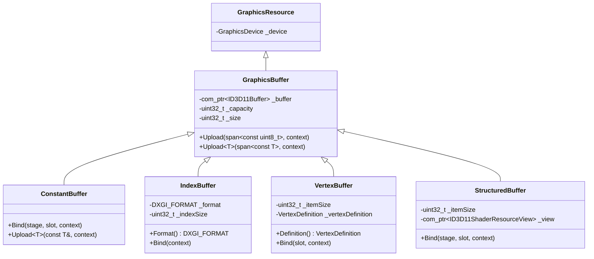

# Buffers

GPU-side buffer wrappers. The `Buffers/` subfolder defines the four classical D3D11 buffer flavours plus a shared base class and the `CapacityOrImmutableData` source variant that lets every buffer type accept either an initial size or initial bytes through one parameter.

## What's in here

| Type | Purpose |
| --- | --- |
| `GraphicsBuffer` | Common base. Holds an `ID3D11Buffer` plus capacity / size, exposes the typed `Upload` template. |
| `ConstantBuffer` | Shader constants (cbuffer). Sized in bytes; the templated constructor sizes from a sample value. |
| `IndexBuffer` | 16- or 32-bit index buffer. The element width is inferred from the template parameter (`uint16_t` → `DXGI_FORMAT_R16_UINT`, `uint32_t` → `DXGI_FORMAT_R32_UINT`). |
| `VertexBuffer` | Per-vertex stream. Uses the `T::Definition` member declared on each vertex layout struct (see [Meshes](Meshes.md)) for the input layout. |
| `StructuredBuffer` | SRV-readable structured buffer of `T`. Carries an `ID3D11ShaderResourceView` and binds to a shader stage / slot. |
| `BufferType` | Enum used by `GraphicsBuffer` (`Index`, `Vertex`, `Constant`, `Structured`). |
| `CapacityOrImmutableData` / `TypedCapacityOrImmutableData<T>` | The "size or bytes" variant — see below. |

## The `CapacityOrImmutableData` source variant

Every buffer constructor accepts a `CapacityOrImmutableData` — a `std::variant<uint32_t, std::span<const uint8_t>>`. There are two cases:

- A `uint32_t` capacity: the buffer is allocated with that byte size, no initial contents, and is `Upload`-able later.
- A `std::span<const uint8_t>`: the buffer is created with `D3D11_USAGE_IMMUTABLE` initial data — fast for static geometry that never changes.

The typed wrapper `TypedCapacityOrImmutableData<T>` makes this idiomatic at call sites — pass `std::span<const T>` (or a `std::vector<T>` that decays to one) and the template multiplies through `sizeof(T)` for you:

```cpp
// 64 KiB, allocated empty, uploadable
ConstantBuffer cb{ device, 64 * 1024 };

// Immutable — initial data is captured
std::vector<uint16_t> indices{ 0, 1, 2,  2, 1, 3 };
IndexBuffer ib{ device, TypedCapacityOrImmutableData<uint16_t>{ indices } };
```

The same source variant flows through `IndexedMesh` / `SimpleMesh`, so call sites mostly get to forget that the variant exists.

## Architecture



## Code examples

### Constant buffer

A constant buffer holds shader-side `cbuffer` data. Size it from a CPU-side struct so the layout matches:

```cpp
struct SceneConstants
{
  DirectX::XMFLOAT4X4 ViewProjection;
  DirectX::XMFLOAT3   CameraPosition;
  float               Time;
};

ConstantBuffer cb{ device, SceneConstants{} };        // size deduced from SceneConstants

SceneConstants cpu{ /* … */ };
cb.Upload(cpu);                                       // memcpy into the buffer

cb.Bind(ShaderStage::Vertex, /*slot*/ 0);
cb.Bind(ShaderStage::Pixel,  /*slot*/ 0);
```

The `Upload<T>` overload static-asserts that `T` is trivially copyable, so it cannot accidentally be misused on a class with a vtable.

### Index buffer

Pick `uint16_t` for meshes that fit in 65 535 vertices (smaller bandwidth) and `uint32_t` for larger ones — the format is selected automatically by the template:

```cpp
std::vector<uint32_t> indices{ /* … */ };

IndexBuffer ib{ device, TypedCapacityOrImmutableData<uint32_t>{ indices } };
ib.Bind();                                            // sets IASetIndexBuffer with R32_UINT

// Later, re-upload (only valid for non-immutable buffers)
std::vector<uint32_t> updated{ /* … */ };
ib.Upload<uint32_t>(updated);
```

### Vertex buffer

`VertexBuffer` reads its input layout from `T::Definition` — every vertex struct in [`VertexDefinitions.h`](Meshes.md) declares one:

```cpp
std::vector<VertexPositionNormalTexture> vertices{ /* … */ };

VertexBuffer vb{ device, TypedCapacityOrImmutableData<VertexPositionNormalTexture>{ vertices } };
vb.Bind(/*slot*/ 0);
```

The `Definition()` accessor is what the matching `VertexShader::InputLayout(...)` call consumes — see [Shaders](Shaders.md).

### Structured buffer

A structured buffer is the natural choice when a compute shader (or any shader stage) needs random-access reads over an array of POD records:

```cpp
struct Particle
{
  DirectX::XMFLOAT3 Position;
  float             Mass;
};

std::vector<Particle> particles(1024);
StructuredBuffer sb{ device, TypedCapacityOrImmutableData<Particle>{ particles } };

sb.Bind(ShaderStage::Compute, /*slot*/ 0);            // bound as t0 in HLSL
```

The wrapper creates the underlying `ID3D11ShaderResourceView` automatically; no manual SRV bookkeeping at the call site.

### Reusing a deferred or alternate context

Every `Bind` / `Upload` accepts an optional `GraphicsDeviceContext*`. Pass it explicitly when targeting a deferred command stream:

```cpp
GraphicsDeviceContext deferred{ /*…*/ };
cb.Upload(cpu, &deferred);
cb.Bind(ShaderStage::Vertex, 0, &deferred);
```

When `nullptr` (the default) the call uses the device's immediate context — see [Devices](Devices.md).

## Files

| File | Contents |
| --- | --- |
| [Graphics/Buffers/GraphicsBuffer.h](../../Axodox.Common.Shared/Graphics/Buffers/GraphicsBuffer.h) / [.cpp](../../Axodox.Common.Shared/Graphics/Buffers/GraphicsBuffer.cpp) | `GraphicsBuffer` base class, the `BufferType` enum, the `CapacityOrImmutableData` variant and its typed `TypedCapacityOrImmutableData<T>` wrapper, plus the templated `Upload<T>(span<const T>)` overload. |
| [Graphics/Buffers/ConstantBuffer.h](../../Axodox.Common.Shared/Graphics/Buffers/ConstantBuffer.h) / [.cpp](../../Axodox.Common.Shared/Graphics/Buffers/ConstantBuffer.cpp) | `ConstantBuffer` with the size-from-sample-value templated constructor and `Bind(stage, slot, context)`. |
| [Graphics/Buffers/IndexBuffer.h](../../Axodox.Common.Shared/Graphics/Buffers/IndexBuffer.h) / [.cpp](../../Axodox.Common.Shared/Graphics/Buffers/IndexBuffer.cpp) | `IndexBuffer` with `uint16_t` / `uint32_t` element-size deduction, `Format()` accessor and `Bind(context)`. |
| [Graphics/Buffers/VertexBuffer.h](../../Axodox.Common.Shared/Graphics/Buffers/VertexBuffer.h) / [.cpp](../../Axodox.Common.Shared/Graphics/Buffers/VertexBuffer.cpp) | `VertexBuffer` carrying its `VertexDefinition` and `Bind(slot, context)`. |
| [Graphics/Buffers/StructuredBuffer.h](../../Axodox.Common.Shared/Graphics/Buffers/StructuredBuffer.h) / [.cpp](../../Axodox.Common.Shared/Graphics/Buffers/StructuredBuffer.cpp) | `StructuredBuffer` plus the `ID3D11ShaderResourceView` it creates internally; `Bind(stage, slot, context)`. |
