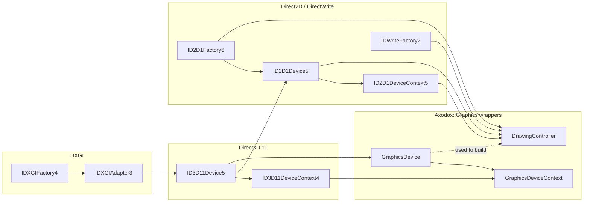

# Devices

The `Devices/` subfolder is the entry point of the Graphics module. Everything else (buffers, textures, shaders, swap chains, …) is constructed against a `GraphicsDevice` and submits work through a `GraphicsDeviceContext`. A separate `DrawingController` exposes the matching Direct2D / DirectWrite stack on top of the same D3D11 device.

## What's in here

| Type | Role |
| --- | --- |
| `GraphicsDevice` | Creates the DXGI factory, picks an adapter, builds the `ID3D11Device5`, queries capabilities, owns the immediate `GraphicsDeviceContext`. |
| `GraphicsDeviceContext` | Wraps the `ID3D11DeviceContext4` and adds a small binding cache so resources can be `Bind`/`Unbind`-ed safely. |
| `GraphicsResource` | Common base for every concrete resource. Holds the `GraphicsDevice` so resources never need an external device handle threaded in. |
| `DrawingController` | Builds an `ID2D1Device5` on top of the D3D11 device, plus an `IDWriteFactory2` for text. Hands out `ID2D1Bitmap1` instances over D3D textures. |
| `DrawingBatch` | RAII helper that pairs `BeginDraw()` / `EndDraw()` on an `ID2D1DeviceContext`. |
| `GraphicsTypes.h` | Versioned typedefs (`IDXGIFactoryT`, `ID3D11DeviceT`, `ID2D1FactoryT`, …) so the module can target a known-good interface revision in one place. |
| `ShaderStage` | The pipeline-stage enum used by the binding methods on the context, on textures, on samplers, on structured buffers, and on constant buffers. |

## Architecture



A few design points worth knowing:

- **`GraphicsDevice` is copyable.** Internally it is a `winrt::com_ptr<ID3D11DeviceT>` plus a few fields. Resources hold a copy via `GraphicsResource::_device`, which is why their constructors don't need a device pointer threaded through.
- **The "immediate" context is owned by the device.** `GraphicsDevice::ImmediateContext()` returns a `GraphicsDeviceContext*` that is shared by every resource that wasn't passed an explicit context.
- **The context keeps a small binding cache.** `BindShaderResourceView`, `BindUnorderedAccessView`, `BindRenderTargetView`, and `BindDepthStencilView` track what is currently bound so the matching `Unbind…` calls are correct, and so that wrappers can safely re-bind without leaking previous slots.
- **`GraphicsCapabilities` is a flag set queried at construction.** `SupportsRenderTargetArrayIndexFromVertexShader`, `SupportsMinMaxFiltering`, `SupportsAsyncCreate`, `SupportsHalfPrecision`, `SupportsAdvancedTypedUAVs`. Inspect it before opting into features that may not be present on older adapters.
- **Debug-layer warnings can be scoped.** `GraphicsDevice::SuppressWarnings(std::vector<D3D11_MESSAGE_ID>&&)` returns an [`Infrastructure::lifetime_token`](../Infrastructure/LifetimeToken.md) that, while alive, suppresses the listed messages. The token's destructor restores them.

## Code examples

### Creating a device

The default constructor picks the first DXGI adapter and builds a feature-level-12.1 device when possible, falling back through 12.0 → 11.1 → 11.0:

```cpp
#include "Include/Axodox.Graphics.h"

using namespace Axodox::Graphics;

GraphicsDevice device;                                // default adapter, no debug layer
auto* context = device.ImmediateContext();            // shared immediate context
```

To enumerate adapters and pick a specific one, use `GraphicsDevice::Adapters()`:

```cpp
for (const auto& info : GraphicsDevice::Adapters())
{
  std::wcout << info.Index << L": " << info.Name
             << L"  " << info.VideoMemory << L" bytes\n";
}

GraphicsDevice device{
  GraphicsDeviceFlags::UseDebugSdkLayers,             // optional flags
  selectedAdapter.Id                                  // LUID
};
```

Available flags include `UseDebugSdkLayers` (enable the D3D debug layer), `UseDebuggableDevice`, `UseWarpDevice` (force the software rasterizer), and `UseDirect3D11On12Device`.

### Wrapping an existing device

If your application already owns an `ID3D11Device` (e.g. handed in from another framework), wrap it without going through DXGI enumeration:

```cpp
winrt::com_ptr<ID3D11Device> existing = ...;
GraphicsDevice device{ existing };
```

The wrapper queries for `ID3D11Device5` and pulls the immediate context out of the underlying device.

### Submitting work through the immediate context

Every binding / drawing helper on a wrapped resource accepts an optional `GraphicsDeviceContext*`. Passing `nullptr` (the default) routes through the device's immediate context:

```cpp
auto* context = device.ImmediateContext();

renderTarget.BindRenderTargetView();                  // immediate context
renderTarget.BindRenderTargetView(/*format*/, context); // explicit (same one here)
renderTarget.Clear({ 0.f, 0.f, 0.f, 1.f });
```

Drop into the raw interface when the wrapper does not cover what you need:

```cpp
context->get()->IASetPrimitiveTopology(D3D11_PRIMITIVE_TOPOLOGY_TRIANGLELIST);
context->get()->Draw(6, 0);
```

### Binding multiple render targets

The context's `BindRenderTargets` overloads are the safe way to bind a set of render targets and (optionally) a depth-stencil:

```cpp
context->BindRenderTargets(&colorTarget, &depthBuffer);

std::array<RenderTarget2D, 2> mrt{ /* … */ };
context->BindRenderTargets(std::span{ mrt }, &depthBuffer);
```

`Unbind…` on each resource is what releases the binding — the cache inside the context is what makes "unbind whatever I bound last" safe.

### Suppressing debug-layer noise

When a routine is known to emit a debug-layer warning that you have already evaluated, scope the suppression with a `lifetime_token`:

```cpp
auto suppression = device.SuppressWarnings({
  D3D11_MESSAGE_ID_DEVICE_DRAW_RENDERTARGETVIEW_NOT_SET,
});

DoTheKnownNoisyWork();                                // warnings suppressed in this scope

// suppression goes out of scope -> warnings re-enabled
```

### Working with Direct2D / DirectWrite

`DrawingController` lives on top of the same D3D11 device. It builds an `ID2D1Device5` and exposes the matching `ID2D1DeviceContext5` plus the shared `IDWriteFactory2`. Pair it with `DrawingBatch` to keep `BeginDraw` / `EndDraw` balanced:

```cpp
DrawingController drawing{ device };

auto* d2dContext = drawing.DrawingContext();
auto  bitmap     = drawing.CreateBitmap(textureComPtr, /*mip*/ 0);

d2dContext->SetTarget(bitmap.get());

{
  DrawingBatch batch{ d2dContext };                   // BeginDraw

  batch->Clear({ 0.f, 0.f, 0.f, 0.f });
  batch->DrawText(text.c_str(), uint32_t(text.size()), textFormat.get(),
                  layoutRect, brush.get());
}                                                     // ~DrawingBatch -> EndDraw
```

For render-target textures that are also Direct2D bitmaps, see [`DrawingTarget2D`](Textures.md) — it bundles a `RenderTarget2D` with a parallel set of `ID2D1Bitmap` views.

### Versioned interface typedefs

When you must touch the underlying COM interface, prefer the typedefs from `GraphicsTypes.h` over the raw versions. That way the entire module advances in lockstep when the targeted interface revision is bumped:

```cpp
ID3D11DeviceT*        d3d  = device.get();             // ID3D11Device5
ID3D11DeviceContextT* ctx  = context->get();           // ID3D11DeviceContext4
```

## Files

| File | Contents |
| --- | --- |
| [Graphics/Devices/GraphicsDevice.h](../../Axodox.Common.Shared/Graphics/Devices/GraphicsDevice.h) / [.cpp](../../Axodox.Common.Shared/Graphics/Devices/GraphicsDevice.cpp) | `GraphicsDevice`, `GraphicsDeviceFlags`, `GraphicsCapabilities`, `AdapterInfo`, the static `Adapters()` enumerator, and the scoped `SuppressWarnings` helper. |
| [Graphics/Devices/GraphicsDeviceContext.h](../../Axodox.Common.Shared/Graphics/Devices/GraphicsDeviceContext.h) / [.cpp](../../Axodox.Common.Shared/Graphics/Devices/GraphicsDeviceContext.cpp) | `GraphicsDeviceContext` wrapper, the `ShaderStage` enum, the binding cache, and the `BindRenderTargets` / `BindShaders` overload set. |
| [Graphics/Devices/GraphicsResource.h](../../Axodox.Common.Shared/Graphics/Devices/GraphicsResource.h) / [.cpp](../../Axodox.Common.Shared/Graphics/Devices/GraphicsResource.cpp) | `GraphicsResource` base class — holds a copy of the owning `GraphicsDevice`. |
| [Graphics/Devices/GraphicsTypes.h](../../Axodox.Common.Shared/Graphics/Devices/GraphicsTypes.h) | Versioned typedefs (`IDXGIFactoryT`, `IDXGIAdapterT`, `ID3D11DeviceT`, `ID3D11DeviceContextT`, `ID2D1FactoryT`, `ID2D1DeviceT`, `ID2D1DeviceContextT`, `ID2D1BitmapT`, `IDWriteFactoryT`). |
| [Graphics/Devices/DrawingController.h](../../Axodox.Common.Shared/Graphics/Devices/DrawingController.h) / [.cpp](../../Axodox.Common.Shared/Graphics/Devices/DrawingController.cpp) | `DrawingController` (Direct2D + DirectWrite on top of the D3D11 device) and `DrawingBatch` (RAII `BeginDraw` / `EndDraw`). |
