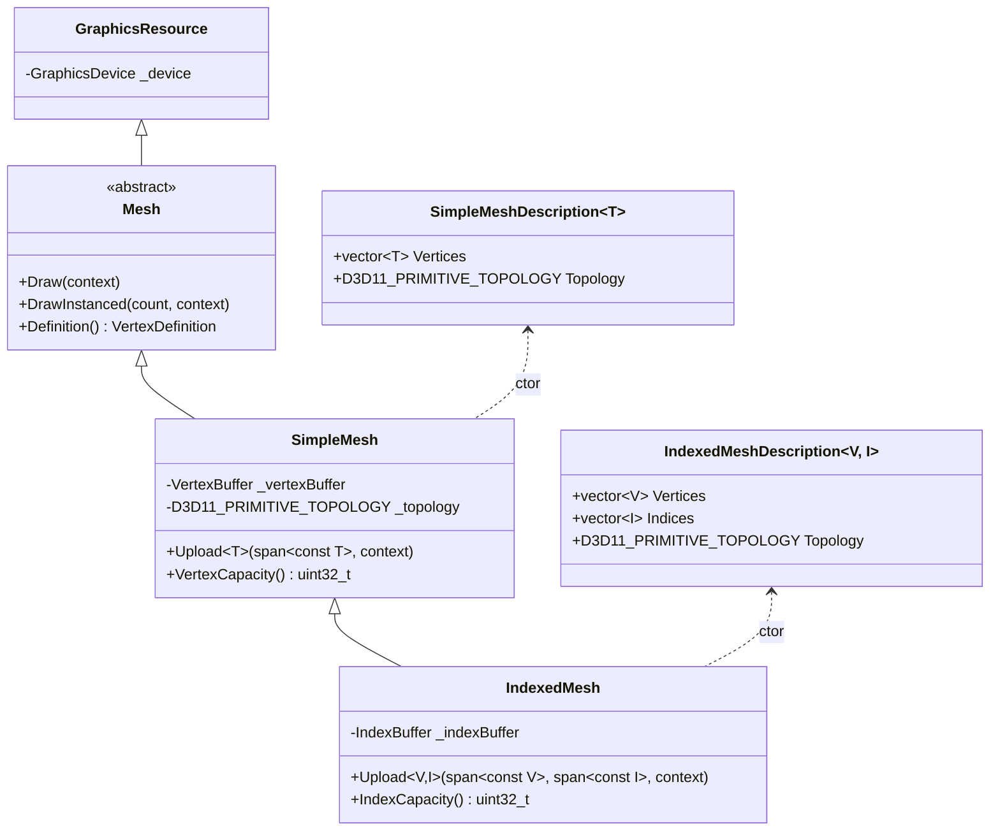

# Meshes

The `Meshes/` subfolder pairs the buffer wrappers from [Buffers](Buffers.md) with vertex layouts and primitive-topology bookkeeping. A `Mesh` knows how to bind itself to the input-assembler stage and issue an indexed or non-indexed draw call. The same templated source variant (`TypedCapacityOrImmutableData<T>`) used by buffers flows through here, so meshes can be constructed either from prepared CPU data or as empty buffers that will be uploaded later.

A small `Primitives.h` factory module sits on top, producing standard quads, cubes, and subdivided planes ready to draw.

## What's in here

| Type | Purpose |
| --- | --- |
| `Mesh` | Abstract base. Declares `Draw` / `DrawInstanced` plus a `Definition()` accessor returning the input layout. |
| `SimpleMesh` | Vertex-only mesh — owns a `VertexBuffer<T>` and a `D3D11_PRIMITIVE_TOPOLOGY`. Non-indexed draws. |
| `IndexedMesh` | `SimpleMesh` plus an `IndexBuffer<I>`. Indexed draws. |
| `SimpleMeshDescription<T>` / `IndexedMeshDescription<T, I>` | Plain structs that bundle vertices (and indices) with topology, useful when meshes come from data pipelines. |
| `Primitives.h` | Free functions returning `IndexedMeshDescription<VertexPositionNormalTexture, uint32_t>` for a unit quad, cube, and subdivided plane. |
| `VertexDefinitions.h` | Six predefined vertex layout structs and the `VertexDefinition` typedef they all expose. |

## Vertex layouts

`VertexDefinition` is just a `std::span<const D3D11_INPUT_ELEMENT_DESC>`. Every layout struct in `VertexDefinitions.h` declares a `static const VertexDefinition Definition` member that matches its own field layout. `VertexBuffer<T>` and `VertexShader::InputLayout(...)` both consume that span — there is no separate registration step.

| Struct | Fields |
| --- | --- |
| `VertexPosition` | `Position` (XMFLOAT3) |
| `VertexPositionColor` | `Position`, `Color` (XMUBYTEN4) |
| `VertexPositionTexture` | `Position`, `Texture` (XMUSHORTN2) |
| `VertexPositionNormal` | `Position`, `Normal` (XMBYTEN4) |
| `VertexPositionNormalColor` | `Position`, `Normal`, `Color` |
| `VertexPositionNormalTexture` | `Position`, `Normal`, `Texture` |

The `Normal` / `Color` / `Texture` fields use the DirectX packed-vector types so each vertex stays compact (typically 16, 20, or 24 bytes).

To define your own vertex format: declare a trivially-copyable struct, fill out its fields, and add a `static const VertexDefinition Definition` populated with `D3D11_INPUT_ELEMENT_DESC` entries that match the byte layout. After that, the templated `VertexBuffer` / `SimpleMesh` / `IndexedMesh` constructors work on it directly.

## Architecture



A few design points to keep in mind:

- **`IndexedMesh` is-a `SimpleMesh`.** It inherits the vertex buffer and topology and adds an index buffer. Code that holds a `SimpleMesh*` can use it polymorphically — but `Draw` resolves through the virtual table to call `DrawIndexed` on `IndexedMesh`.
- **`Definition()` returns the vertex layout.** Pair it with `VertexShader::InputLayout(mesh.Definition())` to pin down the input layout the shader expects. `VertexShader` caches the resulting `ID3D11InputLayout` keyed by the span pointer, so reusing the same `T::Definition` across many shaders is cheap.
- **Description structs are decoupled from the GPU.** `SimpleMeshDescription<T>` / `IndexedMeshDescription<T, I>` are plain CPU records — produce them in a content-loading pipeline, hand them to a mesh constructor, and the GPU buffers are created in one step.

## Code examples

### Static indexed mesh from a description

```cpp
#include "Include/Axodox.Graphics.h"

using namespace Axodox::Graphics;

auto desc = CreateCube(/*size*/ 1.f);                         // IndexedMeshDescription<…>
IndexedMesh mesh{ device, desc };

mesh.Draw();                                                   // bind VB+IB, set topology, DrawIndexed
```

`Primitives.h` ships three factories — pick the one that matches your geometry need:

```cpp
auto quad   = CreateQuad(/*size*/ 1.f);
auto cube   = CreateCube(/*size*/ 1.f, /*useSameTextureOnAllFaces*/ true);
auto plane  = CreatePlane(/*size*/ 4.f, DirectX::XMUINT2{ 16, 16 });
```

### Custom vertex format

```cpp
struct ParticleVertex
{
  DirectX::XMFLOAT3 Position;
  DirectX::XMFLOAT2 SizeXY;
  DirectX::XMFLOAT4 Color;

  static const VertexDefinition Definition;
};

inline const D3D11_INPUT_ELEMENT_DESC kParticleLayout[] = {
  { "POSITION", 0, DXGI_FORMAT_R32G32B32_FLOAT,    0,  0, D3D11_INPUT_PER_VERTEX_DATA, 0 },
  { "TEXCOORD", 0, DXGI_FORMAT_R32G32_FLOAT,       0, 12, D3D11_INPUT_PER_VERTEX_DATA, 0 },
  { "COLOR",    0, DXGI_FORMAT_R32G32B32A32_FLOAT, 0, 20, D3D11_INPUT_PER_VERTEX_DATA, 0 },
};

const VertexDefinition ParticleVertex::Definition = kParticleLayout;
```

You can now use the type with `VertexBuffer<ParticleVertex>`, `SimpleMesh<ParticleVertex>`, and `IndexedMesh<ParticleVertex, …>`.

### Dynamic mesh that gets re-uploaded each frame

When a mesh changes every frame, allocate it with a capacity and call `Upload(...)` on each tick:

```cpp
SimpleMesh mesh{
  device,
  TypedCapacityOrImmutableData<ParticleVertex>{ /*capacity*/ 4096 },
  D3D11_PRIMITIVE_TOPOLOGY_POINTLIST
};

// each frame:
std::span<const ParticleVertex> particles = SimulateParticles(dt);
mesh.Upload(particles);
mesh.Draw();
```

For an indexed mesh, `Upload<V, I>(vertices, indices)` rewrites both buffers in one call.

### Instanced drawing

`Mesh::DrawInstanced(instanceCount, context)` issues `Draw(...Instanced)` instead of `Draw(...)`. Pair it with a per-instance vertex buffer bound to a separate slot to render large numbers of lightweight instances of the same geometry.

```cpp
mesh.DrawInstanced(/*instanceCount*/ 1000);
```

The wrapper does not bind the per-instance buffer for you — bind your second `VertexBuffer<InstanceData>` to slot 1 before the call.

### Pairing with a shader

A typical render snippet ties the mesh's vertex layout to the matching vertex shader's input layout once, then draws as many times as needed:

```cpp
vertexShader.InputLayout(mesh.Definition());
context->BindShaders(&vertexShader, &pixelShader);

mesh.Draw();
```

`VertexShader::InputLayout(...)` caches the resulting `ID3D11InputLayout` keyed by the span pointer of `Definition`, so the call is effectively free after the first time.

## Files

| File | Contents |
| --- | --- |
| [Graphics/Meshes/Mesh.h](../../Axodox.Common.Shared/Graphics/Meshes/Mesh.h) | Abstract `Mesh` base with `Draw` / `DrawInstanced` / `Definition()`. |
| [Graphics/Meshes/SimpleMesh.h](../../Axodox.Common.Shared/Graphics/Meshes/SimpleMesh.h) / [.cpp](../../Axodox.Common.Shared/Graphics/Meshes/SimpleMesh.cpp) | `SimpleMesh` — vertex-only mesh, the `SimpleMeshDescription<T>` description struct, and the templated `Upload<T>`. |
| [Graphics/Meshes/IndexedMesh.h](../../Axodox.Common.Shared/Graphics/Meshes/IndexedMesh.h) / [.cpp](../../Axodox.Common.Shared/Graphics/Meshes/IndexedMesh.cpp) | `IndexedMesh` and `IndexedMeshDescription<V, I>`. |
| [Graphics/Meshes/Primitives.h](../../Axodox.Common.Shared/Graphics/Meshes/Primitives.h) / [.cpp](../../Axodox.Common.Shared/Graphics/Meshes/Primitives.cpp) | Factories: `CreateQuad`, `CreateCube`, `CreatePlane`, all returning `IndexedMeshDescription<VertexPositionNormalTexture, uint32_t>`. |
| [Graphics/Meshes/VertexDefinitions.h](../../Axodox.Common.Shared/Graphics/Meshes/VertexDefinitions.h) / [.cpp](../../Axodox.Common.Shared/Graphics/Meshes/VertexDefinitions.cpp) | The `VertexDefinition` typedef and the six predefined vertex layout structs. |
