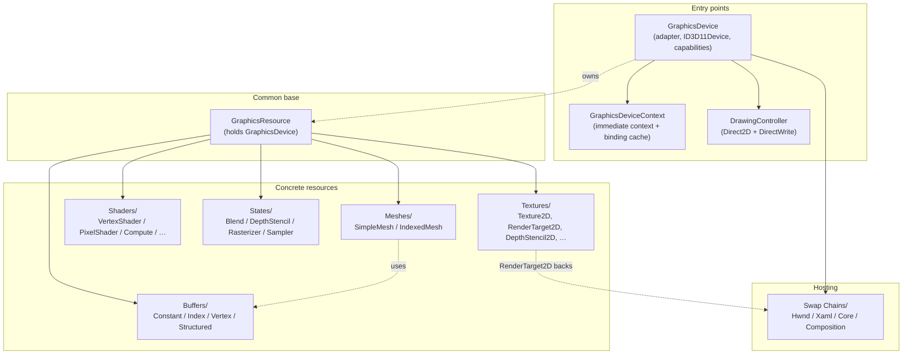

# Graphics

`Axodox::Graphics` is a Direct3D 11 / Direct2D wrapper layer. It groups COM resources and pipeline state behind RAII C++ classes, lets typical render-loop code stay free of `winrt::com_ptr` plumbing, and exposes a small set of swap-chain types covering all the common Windows hosting models (HWND, XAML, CoreWindow, Composition).

The whole module is reachable via the umbrella header `#include "Include/Axodox.Graphics.h"`. Everything lives in the `Axodox::Graphics` namespace. The whole module is Windows-only and most of it (everything except the math primitives) additionally requires DirectX — the Graphics umbrella guards the DirectX-dependent headers behind `#if defined(USE_DIRECTX) && defined(PLATFORM_WINDOWS)`.

> Note: this module follows **PascalCase** for type, method, and field names — see the [Coding conventions](../Conventions.md) for why.

## Topic guides

The Graphics tree is already split into thematic subfolders; this documentation mirrors that structure. Each link is a stand-alone document with the architecture, examples, and file references for that subfolder.

| Subfolder | Topic guide | What's inside |
| --- | --- | --- |
| `Devices/` | [Devices](Devices.md) | `GraphicsDevice` (factory + adapter + ID3D11Device), `GraphicsDeviceContext` (command stream + binding cache), `GraphicsResource` base, `DrawingController` / `DrawingBatch` (Direct2D + DirectWrite), `GraphicsTypes.h` (versioned typedefs), `ShaderStage` enum. |
| `Buffers/` | [Buffers](Buffers.md) | `GraphicsBuffer` base plus `ConstantBuffer`, `IndexBuffer`, `StructuredBuffer`, `VertexBuffer`. The `CapacityOrImmutableData` / `TypedCapacityOrImmutableData<T>` source variant. |
| `Math/` | [Math](Math.md) | `Point` / `Size` / `Rect` value types with the geometry helpers used across Graphics. Available even without DirectX. |
| `Meshes/` | [Meshes](Meshes.md) | `Mesh` abstract base, `SimpleMesh` (vertex-only), `IndexedMesh` (vertex + index), `Primitives` factory, `VertexDefinitions` (`VertexPosition`, `VertexPositionColor`, `VertexPositionTexture`, `VertexPositionNormal`, `VertexPositionNormalColor`, `VertexPositionNormalTexture`). |
| `Shaders/` | [Shaders](Shaders.md) | One class per pipeline stage: `VertexShader`, `HullShader`, `DomainShader`, `GeometryShader`, `PixelShader`, `ComputeShader`. |
| `States/` | [States](States.md) | `BlendState` (with the `BlendType` preset enum), `DepthStencilState`, `RasterizerState` (with the `RasterizerFlags` flag enum), `SamplerState`. |
| `Swap Chains/` | [SwapChains](SwapChains.md) | `SwapChain` abstract base plus `HwndSwapChain`, `XamlSwapChain`, `CoreSwapChain`, `CompositionSwapChain`. |
| `Textures/` | [Textures](Textures.md) | `Texture2DDefinition`, `Texture2D`, `RenderTarget2D`, `DepthStencil2D`, `RenderTargetWithDepthStencil2D`, `StagingTexture2D`, `DrawingTarget2D`, and the CPU-side `TextureData`. |

There is also a top-level `Helpers.h` in the Graphics root — see [Format helpers](#format-helpers) below.

## Architecture at a glance

The classes in the Graphics module are layered: a `GraphicsDevice` and its `GraphicsDeviceContext` are the entry points, every concrete resource derives from `GraphicsResource` (which holds a copy of the device), and consumers compose those resources into a render loop.



## Cross-cutting conventions

A handful of patterns repeat throughout the module; understanding them once saves time when reading any of the topic guides:

- **Three-layer access for COM wrappers.** Every wrapper that holds a `winrt::com_ptr<…>` exposes the same trio: `operator*` returns the smart pointer, `operator->` returns the raw interface for member calls, `get()` returns the raw pointer. Use whichever fits the call site.
- **Optional `GraphicsDeviceContext*` parameter.** `Bind`, `Upload`, `Clear`, `Discard`, `Run`, … all accept an optional `GraphicsDeviceContext* context = nullptr`. Passing `nullptr` (the default) routes through the device's immediate context; passing an explicit context lets callers target a deferred context or a different command stream.
- **`GraphicsResource` ownership.** Every resource carries a copy of its `GraphicsDevice` so that creation and binding never need an external device pointer threaded through the call site. The copy is cheap — `GraphicsDevice` is a `winrt::com_ptr` plus a few fields.
- **Capacity vs. immutable data.** Buffer-backed resources accept their initial state through a `CapacityOrImmutableData` variant — either a `uint32_t` capacity (allocate empty) or a `std::span<const uint8_t>` (allocate and upload). The typed `TypedCapacityOrImmutableData<T>` wraps it so call sites can pass `std::span<const T>` or `uint32_t` directly without manual reinterpretation.
- **Versioned typedefs.** `GraphicsTypes.h` typedef-aliases the specific Direct3D / Direct2D / DirectWrite interface versions the library targets (e.g. `ID3D11Device5`, `IDXGIFactory4`). Use those typedefs (`ID3D11DeviceT`, `IDXGIFactoryT`, …) instead of hard-coding a version when you need to interact with the underlying COM interface.

## Format helpers

`Graphics/Helpers.h` is a small grab-bag of format-conversion utilities used across the module:

```cpp
size_t BitsPerPixel(DXGI_FORMAT format);
bool   HasAlpha(DXGI_FORMAT format);
bool   IsUByteN1Compatible(DXGI_FORMAT format);
bool   IsUByteN4Compatible(DXGI_FORMAT format);

IWICImagingFactory* WicFactory();        // process-wide WIC factory

// WIC <-> DXGI
WICPixelFormatGUID ToWicPixelFormat(DXGI_FORMAT format);
DXGI_FORMAT        ToDxgiFormat(WICPixelFormatGUID format);

// SoftwareBitmap <-> DXGI (gated by WINRT_Windows_Graphics_Imaging_H)
winrt::Windows::Graphics::Imaging::BitmapPixelFormat ToBitmapPixelFormat(DXGI_FORMAT format);
DXGI_FORMAT                                          ToDxgiFormat(winrt::Windows::Graphics::Imaging::BitmapPixelFormat format);
```

These are exposed at namespace scope rather than living in any subfolder; reach for them when bridging DXGI formats with WIC or with the `Windows.Graphics.Imaging` projection.

## Files

| File | Topic guide | Summary |
| --- | --- | --- |
| [Include/Axodox.Graphics.h](../../Axodox.Common.Shared/Include/Axodox.Graphics.h) | (umbrella) | Public umbrella header. Math types are always available; the rest is gated by `USE_DIRECTX` and `PLATFORM_WINDOWS`. |
| [Graphics/Helpers.h](../../Axodox.Common.Shared/Graphics/Helpers.h) / [.cpp](../../Axodox.Common.Shared/Graphics/Helpers.cpp) | (this page) | Free-function format helpers: `BitsPerPixel`, `HasAlpha`, `WicFactory()`, plus DXGI ↔ WIC ↔ `BitmapPixelFormat` converters. |
| [Graphics/Devices/](../../Axodox.Common.Shared/Graphics/Devices/) | [Devices](Devices.md) | `GraphicsDevice`, `GraphicsDeviceContext`, `GraphicsResource`, `DrawingController`, `DrawingBatch`, `GraphicsTypes.h`. |
| [Graphics/Buffers/](../../Axodox.Common.Shared/Graphics/Buffers/) | [Buffers](Buffers.md) | `GraphicsBuffer` base; `ConstantBuffer`, `IndexBuffer`, `StructuredBuffer`, `VertexBuffer`. |
| [Graphics/Math/](../../Axodox.Common.Shared/Graphics/Math/) | [Math](Math.md) | `Point`, `Size`, `Rect`. |
| [Graphics/Meshes/](../../Axodox.Common.Shared/Graphics/Meshes/) | [Meshes](Meshes.md) | `Mesh`, `SimpleMesh`, `IndexedMesh`, `Primitives`, `VertexDefinitions`. |
| [Graphics/Shaders/](../../Axodox.Common.Shared/Graphics/Shaders/) | [Shaders](Shaders.md) | `VertexShader`, `HullShader`, `DomainShader`, `GeometryShader`, `PixelShader`, `ComputeShader`. |
| [Graphics/States/](../../Axodox.Common.Shared/Graphics/States/) | [States](States.md) | `BlendState`, `DepthStencilState`, `RasterizerState`, `SamplerState`. |
| [Graphics/Swap Chains/](../../Axodox.Common.Shared/Graphics/Swap%20Chains/) | [SwapChains](SwapChains.md) | `SwapChain`, `HwndSwapChain`, `XamlSwapChain`, `CoreSwapChain`, `CompositionSwapChain`. |
| [Graphics/Textures/](../../Axodox.Common.Shared/Graphics/Textures/) | [Textures](Textures.md) | `Texture2DDefinition`, `Texture2D`, `RenderTarget2D`, `DepthStencil2D`, `RenderTargetWithDepthStencil2D`, `StagingTexture2D`, `DrawingTarget2D`, `TextureData`. |
