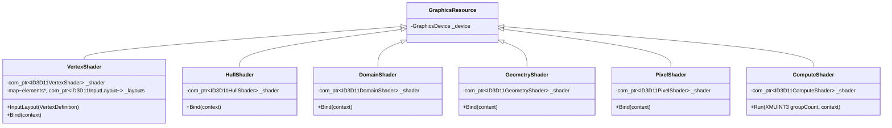

# Shaders

The `Shaders/` subfolder ships one wrapper class per Direct3D 11 pipeline stage. Every wrapper is constructed from a compiled shader byte-code blob (a `std::span<const uint8_t>`), creates the matching `ID3D11*Shader` interface, and exposes a `Bind(context)` method that sets it on the immediate context (or an explicit one).

The `VertexShader` wrapper is slightly richer than the others: it also caches the `ID3D11InputLayout` that ties the shader's input signature to a [`VertexDefinition`](Meshes.md). The compute shader wrapper exposes `Run(groupCount)` instead of `Bind` because compute is dispatched directly rather than bound and then drawn.

The library does not bundle a shader compiler — produce the byte code with `D3DCompile` / `fxc` / `dxc` at build time, embed it in your binary, and pass it to the shader constructors at runtime.

## Stages

| Class | Underlying interface | Operation |
| --- | --- | --- |
| `VertexShader` | `ID3D11VertexShader` | `Bind(context)` + `InputLayout(definition)` |
| `HullShader` | `ID3D11HullShader` | `Bind(context)` |
| `DomainShader` | `ID3D11DomainShader` | `Bind(context)` |
| `GeometryShader` | `ID3D11GeometryShader` | `Bind(context)` |
| `PixelShader` | `ID3D11PixelShader` | `Bind(context)` |
| `ComputeShader` | `ID3D11ComputeShader` | `Run(groupCount, context)` |

## Architecture



A few design points worth knowing:

- **`VertexShader` retains the byte code.** It needs the source span available for the lifetime of the shader because every new `InputLayout(definition)` call passes it back to `ID3D11Device::CreateInputLayout`. The wrapper copies the buffer into an internal `std::vector<uint8_t>` so callers don't have to keep the original alive.
- **Input layouts are cached.** The cache is keyed by the `D3D11_INPUT_ELEMENT_DESC*` pointer of the supplied `VertexDefinition`. As long as you reuse the same `T::Definition` static, the lookup is a single map probe — zero CreateInputLayout calls after the first.
- **`Bind(...)` only sets the shader.** Constant buffers, samplers, SRVs, and UAVs are bound separately through `ConstantBuffer::Bind`, `SamplerState::Bind`, `Texture2D::BindShaderResourceView`, etc. The library does not introduce a "material" concept.
- **`ComputeShader::Run(groupCount, …)`** dispatches `Dispatch(groupCount.x, groupCount.y, groupCount.z)` after binding the shader. Bind any required buffers / textures *before* the call; the wrapper does not unbind anything afterwards.

## Code examples

### Loading a vertex + pixel shader pair

Read the compiled byte code from disk (or an embedded resource), construct the wrappers, then bind them through the device context:

```cpp
#include "Include/Axodox.Storage.h"
#include "Include/Axodox.Graphics.h"

using namespace Axodox::Graphics;
using namespace Axodox::Storage;

auto vsBytes = read_file("shaders/MainVS.cso");        // std::vector<uint8_t>
auto psBytes = read_file("shaders/MainPS.cso");

VertexShader vs{ device, vsBytes };
PixelShader  ps{ device, psBytes };

context->BindShaders(&vs, &ps);
```

`GraphicsDeviceContext::BindShaders` has overloads covering vertex+pixel, vertex+geometry+pixel, and the full tessellation pipeline (vertex+hull+domain+pixel, optionally with geometry). Use whichever matches your pipeline.

### Hooking up the input layout

The vertex shader's input signature must agree with the layout the vertex buffer publishes. Pin them together with one call before the first draw:

```cpp
vs.InputLayout(mesh.Definition());                     // e.g. VertexPositionNormalTexture::Definition
mesh.Draw();
```

Subsequent calls with the same definition pointer reuse the cached layout; you can call this every frame without paying for `CreateInputLayout` after the first time.

### Running a compute shader

```cpp
auto csBytes = read_file("shaders/SimulateCS.cso");
ComputeShader cs{ device, csBytes };

// bind inputs / outputs first
inputBuffer.Bind(ShaderStage::Compute, /*slot*/ 0);
context->BindUnorderedAccessView(outputUav.get(), /*slot*/ 0);

cs.Run({ /*groupCountX*/ 64, /*groupCountY*/ 1, /*groupCountZ*/ 1 });

// unbind UAVs when you're done so they're free for later passes
context->UnbindUnorderedAccessView(outputUav.get());
```

`groupCount` is a `DirectX::XMUINT3` — pass `{ groupCountX, groupCountY, groupCountZ }`. The wrapper does not automatically scale by your thread-group size; compute that on the CPU side from the data dimensions and your `numthreads` declaration.

### Tessellation pipeline

When using hull and domain shaders, instantiate all four stages and bind them together:

```cpp
VertexShader   vs { device, vsBytes };
HullShader     hs { device, hsBytes };
DomainShader   ds { device, dsBytes };
PixelShader    ps { device, psBytes };

context->BindShaders(&vs, &hs, &ds, &ps);
```

A geometry-shader variant exists too — use the five-arg overload of `BindShaders`.

### Pairing with constant buffers and samplers

Shader bindings are wired separately. A typical pre-draw setup looks like:

```cpp
constants.Upload(cpuConstants);
constants.Bind(ShaderStage::Vertex, /*slot*/ 0);
constants.Bind(ShaderStage::Pixel,  /*slot*/ 0);

texture.BindShaderResourceView(ShaderStage::Pixel, /*slot*/ 0);
sampler.Bind(ShaderStage::Pixel, /*slot*/ 0);

context->BindShaders(&vs, &ps);
mesh.Draw();
```

See [Buffers](Buffers.md), [Textures](Textures.md), and [States](States.md) for the matching wrappers.

## Files

| File | Contents |
| --- | --- |
| [Graphics/Shaders/VertexShader.h](../../Axodox.Common.Shared/Graphics/Shaders/VertexShader.h) / [.cpp](../../Axodox.Common.Shared/Graphics/Shaders/VertexShader.cpp) | `VertexShader` with `InputLayout(VertexDefinition)` and a per-definition `ID3D11InputLayout` cache. |
| [Graphics/Shaders/HullShader.h](../../Axodox.Common.Shared/Graphics/Shaders/HullShader.h) / [.cpp](../../Axodox.Common.Shared/Graphics/Shaders/HullShader.cpp) | `HullShader`. |
| [Graphics/Shaders/DomainShader.h](../../Axodox.Common.Shared/Graphics/Shaders/DomainShader.h) / [.cpp](../../Axodox.Common.Shared/Graphics/Shaders/DomainShader.cpp) | `DomainShader`. |
| [Graphics/Shaders/GeometryShader.h](../../Axodox.Common.Shared/Graphics/Shaders/GeometryShader.h) / [.cpp](../../Axodox.Common.Shared/Graphics/Shaders/GeometryShader.cpp) | `GeometryShader`. |
| [Graphics/Shaders/PixelShader.h](../../Axodox.Common.Shared/Graphics/Shaders/PixelShader.h) / [.cpp](../../Axodox.Common.Shared/Graphics/Shaders/PixelShader.cpp) | `PixelShader`. |
| [Graphics/Shaders/ComputeShader.h](../../Axodox.Common.Shared/Graphics/Shaders/ComputeShader.h) / [.cpp](../../Axodox.Common.Shared/Graphics/Shaders/ComputeShader.cpp) | `ComputeShader` with `Run(XMUINT3 groupCount, context)`. |
