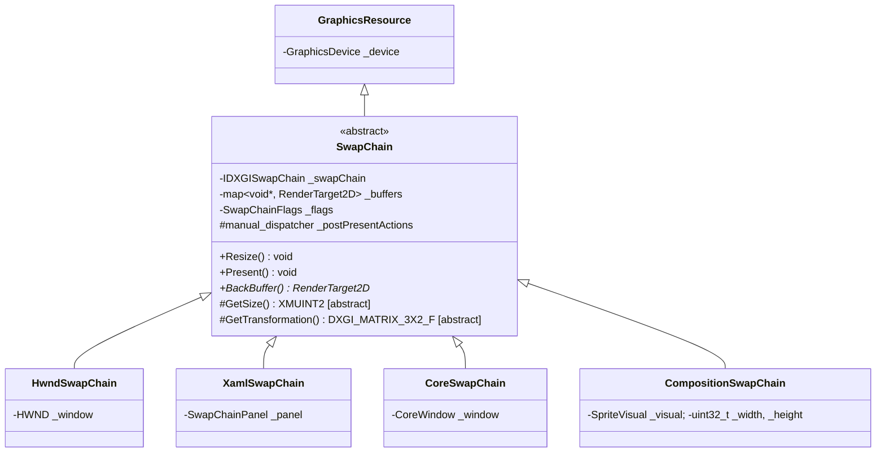

# Swap Chains

A swap chain is the bridge between the GPU and a presentation surface. The `Swap Chains/` subfolder ships one base class plus four concrete variants, each tailored to a specific Windows hosting model (Win32 HWND, XAML `SwapChainPanel`, UWP `CoreWindow`, and visual-tree composition). All four expose the same render-loop API — call `Resize()` when the host changes size, render into the back buffer, then call `Present()`.

> The folder name on disk contains a literal space — `Graphics/Swap Chains/` — and is referenced verbatim from the project files. Keep it.

## What's in here

| Type | Hosting model |
| --- | --- |
| `SwapChain` | Abstract base. Owns the `IDXGISwapChain`, the back-buffer `RenderTarget2D` cache, and the post-present dispatcher. |
| `HwndSwapChain` | Top-level Win32 windows (`HWND`). Use this for desktop applications. |
| `XamlSwapChain` | UWP/WinUI XAML hosting via `Windows.UI.Xaml.Controls.SwapChainPanel`. |
| `CoreSwapChain` | Plain UWP `Windows.UI.Core.CoreWindow` (no XAML). |
| `CompositionSwapChain` | Windows.UI.Composition trees — created via `CreateSwapChainForComposition` and exposed as a `SpriteVisual` you can attach anywhere in a composition tree. |
| `SwapChainFlags` | Enum: `Default`, `IsShaderResource`, `IsTearingAllowed` (variable refresh rate / G-Sync / FreeSync). |

## Architecture



A few design points worth knowing:

- **Back buffers are wrapped lazily and cached.** `BackBuffer()` returns a `RenderTarget2D*` over the current back buffer, creating it on first access and remembering it across presents. After `Resize()` the cache is rebuilt from scratch.
- **`Resize()` matches the host's current size.** The HWND, XAML, and CoreWindow variants implement `GetSize()` by querying the host (window rect, panel actual size + composition scale, core window bounds). `CompositionSwapChain` is different — it has no host to query, so the call site drives sizing via the explicit `Resize(width, height)` overload.
- **Post-present actions are pumped through a `manual_dispatcher`.** Anything queued via the protected `_postPresentActions` member runs on the same thread that called `Present()`, immediately after the call returns. The library uses this internally to defer COM cleanup that must run after the GPU has acknowledged the present.
- **Flags are layered onto the swap-chain description.** `IsShaderResource` adds `DXGI_USAGE_SHADER_INPUT` so the back buffer can be sampled. `IsTearingAllowed` enables variable-refresh present (`DXGI_FEATURE_PRESENT_ALLOW_TEARING`).

## Code examples

### HWND swap chain

The desktop case. Create the swap chain once with the window handle, attach to the host's resize event, and run a render loop:

```cpp
#include "Include/Axodox.Graphics.h"

using namespace Axodox::Graphics;

GraphicsDevice device;
HwndSwapChain  swapChain{ device, hwnd };

// On window resize:
swapChain.Resize();

// Render loop:
auto* back = swapChain.BackBuffer();
back->BindRenderTargetView();
back->Clear({ 0.1f, 0.1f, 0.12f, 1.f });

DrawScene();

swapChain.Present();
```

Use `SwapChainFlags::IsTearingAllowed` if your window will run on an unfocused/borderless presentation path that benefits from VRR:

```cpp
HwndSwapChain swapChain{ device, hwnd, SwapChainFlags::IsTearingAllowed };
```

### XAML `SwapChainPanel`

`XamlSwapChain` subscribes to `SizeChanged` and `CompositionScaleChanged` on the panel automatically — when either fires, calling `Resize()` is enough. The wrapper also accounts for composition scale when reporting the back-buffer size, so the rendered content stays sharp on high-DPI displays:

```cpp
#include <winrt/Windows.UI.Xaml.Controls.h>

XamlSwapChain swapChain{ device, swapChainPanel };

// Whenever you receive size or scale change notifications,
// or just before a frame, call Resize() if necessary.
swapChain.Resize();

auto* back = swapChain.BackBuffer();
// … render and present …
swapChain.Present();
```

### CoreWindow

For plain UWP apps without XAML, use `CoreSwapChain`. Like the XAML variant, it subscribes to size-changed events on the host:

```cpp
#include <winrt/Windows.UI.Core.h>

CoreSwapChain swapChain{ device, coreWindow };
```

The render loop is identical to the HWND case.

### Composition

`CompositionSwapChain` is for hosts that want to embed the swap chain in a `Windows.UI.Composition` visual tree without going through XAML. The constructor takes an explicit width/height, and `Visual()` exposes a `SpriteVisual` the caller can attach anywhere:

```cpp
#include <winrt/Windows.UI.Composition.h>

CompositionSwapChain swapChain{ device, compositor, 1920, 1080 };

// Attach the visual to your composition tree.
auto root = compositor.CreateContainerVisual();
root.Children().InsertAtTop(swapChain.Visual());

// When the host's size changes, drive it explicitly:
swapChain.Resize(2560, 1440);
```

Because there is no panel or window to query, the host is responsible for propagating size changes — the wrapper will not detect them on its own.

### Shader-readable back buffers

Set `SwapChainFlags::IsShaderResource` to allow binding the back buffer (or a previous frame copy) as a shader resource — useful for post-processing pipelines that read the rendered image:

```cpp
HwndSwapChain swapChain{ device, hwnd, SwapChainFlags::IsShaderResource };

auto* back = swapChain.BackBuffer();
back->BindShaderResourceView(ShaderStage::Pixel, /*slot*/ 0);
```

## Files

| File | Contents |
| --- | --- |
| [Graphics/Swap Chains/SwapChain.h](../../Axodox.Common.Shared/Graphics/Swap%20Chains/SwapChain.h) / [.cpp](../../Axodox.Common.Shared/Graphics/Swap%20Chains/SwapChain.cpp) | Abstract `SwapChain` base, `SwapChainFlags`, the back-buffer cache, and the post-present `manual_dispatcher`. |
| [Graphics/Swap Chains/HwndSwapChain.h](../../Axodox.Common.Shared/Graphics/Swap%20Chains/HwndSwapChain.h) / [.cpp](../../Axodox.Common.Shared/Graphics/Swap%20Chains/HwndSwapChain.cpp) | `HwndSwapChain` for top-level Win32 windows. |
| [Graphics/Swap Chains/XamlSwapChain.h](../../Axodox.Common.Shared/Graphics/Swap%20Chains/XamlSwapChain.h) / [.cpp](../../Axodox.Common.Shared/Graphics/Swap%20Chains/XamlSwapChain.cpp) | `XamlSwapChain` for `Windows.UI.Xaml.Controls.SwapChainPanel`; tracks size and composition-scale changes. |
| [Graphics/Swap Chains/CoreSwapChain.h](../../Axodox.Common.Shared/Graphics/Swap%20Chains/CoreSwapChain.h) / [.cpp](../../Axodox.Common.Shared/Graphics/Swap%20Chains/CoreSwapChain.cpp) | `CoreSwapChain` for `Windows.UI.Core.CoreWindow`. |
| [Graphics/Swap Chains/CompositionSwapChain.h](../../Axodox.Common.Shared/Graphics/Swap%20Chains/CompositionSwapChain.h) / [.cpp](../../Axodox.Common.Shared/Graphics/Swap%20Chains/CompositionSwapChain.cpp) | `CompositionSwapChain` exposing a `Windows.UI.Composition.Visual` and the explicit `Resize(width, height)` overload. |
