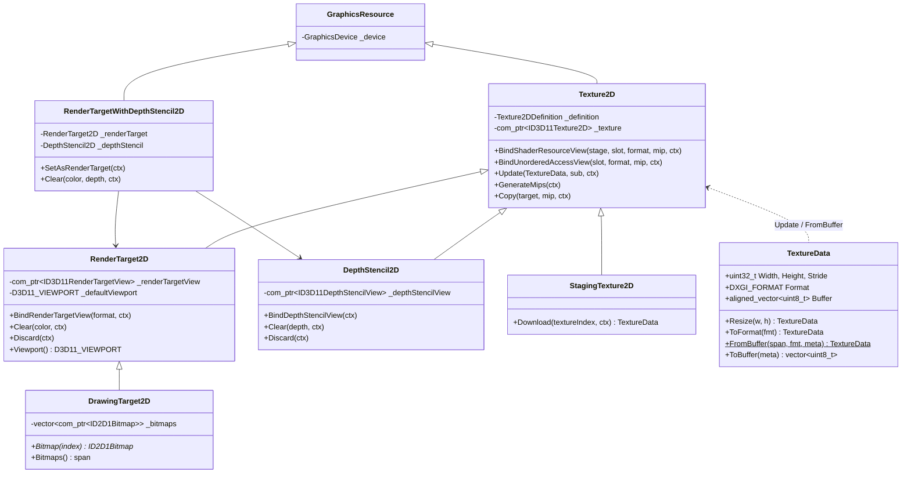

# Textures

The `Textures/` subfolder is the largest in the Graphics module. It covers the full lifecycle of 2D textures — describing them, creating them on the GPU, using them as render targets / depth-stencils / shader resources / Direct2D bitmaps, copying them back to the CPU, and manipulating the CPU-side pixel data through a separate value-type called `TextureData`.

The classes layer on top of one another: `Texture2D` is the base GPU resource; `RenderTarget2D`, `DepthStencil2D`, `StagingTexture2D`, and `DrawingTarget2D` are specialised flavours; `RenderTargetWithDepthStencil2D` is a convenience bundle; and `TextureData` is a CPU-side container with conversion helpers and a small set of image operations.

## What's in here

| Type | Role |
| --- | --- |
| `Texture2DDefinition` | Plain struct describing a 2D texture. Width / height / format / sample count / mip count / array slices / `Texture2DFlags` / view formats. |
| `Texture2DFlags` | Flag enum: `Updateable`, `Unordered`, `RenderTarget`, `DepthStencil`, `Array`, `Cube`, `GenerateMips`, `Staging`. |
| `Texture2D` | Base GPU texture wrapper. Owns the `ID3D11Texture2D` plus a cache of SRVs and UAVs (default and per-format/per-mip alternates). |
| `RenderTarget2D` | `Texture2D` plus an `ID3D11RenderTargetView` and a default `D3D11_VIEWPORT`. Adds `Clear` / `Discard`. |
| `DepthStencil2D` | `Texture2D` plus an `ID3D11DepthStencilView`. Adds `Clear(depth)` / `Discard`. |
| `RenderTargetWithDepthStencil2D` | Convenience pair: a `RenderTarget2D` and a matching `DepthStencil2D` constructed from one definition + a depth format. |
| `StagingTexture2D` | CPU-readable staging texture. Adds `Download(...)` returning a `TextureData`. |
| `DrawingTarget2D` | `RenderTarget2D` whose subresources are also wrapped as `ID2D1Bitmap` instances for Direct2D rendering. |
| `TextureData` | CPU-side image container. Format-aware buffer, image conversions (WIC, SoftwareBitmap), resize / crop / merge / alpha blend, raw and metadata-bearing serialisation. |
| `TextureImageFormat` | Helper enum for `TextureData::FromBuffer` (`Unknown`, `Rgba8`, `Gray8`). |

## Architecture



A few design points to keep in mind:

- **`Texture2DDefinition` is the single description struct.** It has two convenience constructors — one with `Texture2DFlags` and an optional `viewFormat`, the other with raw sample-count/quality/array parameters — but they all populate the same fields. `ToDescription()` produces the matching `D3D11_TEXTURE2D_DESC`; `FromDescription()` reverses the mapping for textures created elsewhere.
- **Alternate views are cached.** `Texture2D` keeps maps of SRVs and UAVs keyed by `(format, mip)`, so binding the same texture with a different view format or a specific mip is cheap after the first call. `RenderTarget2D` keeps a similar cache for alternate-format render-target views.
- **`Bind*` / `Unbind*` flow through `GraphicsDeviceContext`.** The context's binding cache makes "unbind whatever I bound earlier" reliable. `Texture2D::Unbind(...)` is virtual so derived flavours can also remove their RTV / DSV.
- **`StagingTexture2D` is the GPU→CPU bridge.** Construct one with `Texture2DFlags::Staging`, `Copy` from another texture, then `Download(...)` to obtain a `TextureData`.
- **`TextureData` lives on the CPU.** It uses an `aligned_vector<uint8_t>` for SIMD-friendly access, knows its `Format`, and has explicit copy semantics — copies are explicit (`explicit TextureData(const TextureData&) = default`), moves are implicit. The conversion helpers (WIC, SoftwareBitmap) are gated behind their respective platform headers.

## Code examples

### Describing and creating a texture

`Texture2DDefinition` is just a struct — fill out only the fields you care about and let the rest default:

```cpp
#include "Include/Axodox.Graphics.h"

using namespace Axodox::Graphics;

Texture2DDefinition def{
  /*width*/  512,
  /*height*/ 512,
  /*format*/ DXGI_FORMAT_R8G8B8A8_UNORM_SRGB,
  /*flags*/  Texture2DFlags::RenderTarget
};

RenderTarget2D rt{ device, def };                     // also creates the RTV
rt.Clear({ 0.f, 0.f, 0.f, 1.f });
```

`Texture2DFlags` combines via the operators in [Infrastructure/BitwiseOperations](../Infrastructure/BitwiseOperations.md):

```cpp
using namespace Axodox::Infrastructure;

Texture2DDefinition multi{
  1024, 1024, DXGI_FORMAT_R16G16B16A16_FLOAT,
  bitwise_or(Texture2DFlags::RenderTarget, Texture2DFlags::GenerateMips),
  /*mipCount*/ 0                                       // 0 => full chain
};
```

### Render target + depth pair

`RenderTargetWithDepthStencil2D` is the natural fit for the common case of a single colour buffer paired with a depth buffer:

```cpp
RenderTargetWithDepthStencil2D rt{
  device,
  Texture2DDefinition{ width, height, DXGI_FORMAT_R8G8B8A8_UNORM_SRGB,
                       Texture2DFlags::RenderTarget }
};

rt.SetAsRenderTarget();
rt.Clear({ 0.05f, 0.05f, 0.07f, 1.f }, /*depth*/ 1.f);

DrawScene();
```

`SetAsRenderTarget` binds both views in one call. The colour and depth views can also be bound separately via the inner `RenderTarget()` and `DepthStencil()` accessors.

### Sampling a texture in a shader

```cpp
texture.BindShaderResourceView(ShaderStage::Pixel, /*slot*/ 0);
sampler.Bind(ShaderStage::Pixel, /*slot*/ 0);

context->BindShaders(&vs, &ps);
mesh.Draw();

texture.Unbind();                                     // releases SRV + RTV slots if any
```

A specific mip level or alternate format can be requested through the optional parameters:

```cpp
texture.BindShaderResourceView(ShaderStage::Pixel, /*slot*/ 0,
  /*format*/ DXGI_FORMAT_R8G8B8A8_UNORM,              // re-typed view
  /*mip*/    2);                                      // single-mip view
```

### Compute writing through a UAV

`Texture2D::BindUnorderedAccessView` works the same way. Bind the UAV, dispatch the compute shader, then unbind so the slot can be used elsewhere later:

```cpp
output.BindUnorderedAccessView(/*slot*/ 0);
computeShader.Run({ groupCountX, groupCountY, 1 });
output.UnbindUnorderedAccessView();
```

### Uploading CPU pixels

`Texture2D::Update(textureData, subresourceIndex, context)` re-uploads pixels from a `TextureData`. Use it to refresh a `Texture2DFlags::Updateable` (i.e. dynamic) texture:

```cpp
auto pixels = TextureData::FromBuffer(pngBytes, TextureImageFormat::Rgba8);
texture.Update(pixels);
```

### Reading the GPU back into a `TextureData`

```cpp
StagingTexture2D staging{
  device,
  Texture2DDefinition{ source.Definition().Width, source.Definition().Height,
                       source.Definition().Format, Texture2DFlags::Staging }
};

source.Copy(&staging);
auto cpu = staging.Download();                        // TextureData
auto png = cpu.ToBuffer();                            // WIC-encoded PNG
```

`Copy` runs on the GPU; `Download` blocks until the copy is visible and then maps the staging texture to fill the `TextureData`.

### Working with `TextureData`

```cpp
auto img = TextureData::FromBuffer(read_file("input.png"), TextureImageFormat::Rgba8);

auto half = img.Resize(img.Width / 2, img.Height / 2);
auto fit  = img.UniformResize(1024, 1024, /*sourceRect*/ nullptr);
auto cropped = img.GetTexture(Rect::FromLeftTopSize({ 16, 16 }, { 256, 256 }));

write_file("output.png", img.ToBuffer());
```

Pixel-level access is templated:

```cpp
struct Rgba8 { uint8_t R, G, B, A; };

for (uint32_t y = 0; y < img.Height; y++)
{
  auto* row = img.Row<Rgba8>(y);
  for (uint32_t x = 0; x < img.Width; x++) Process(row[x]);
}
```

### Direct2D drawing onto a texture

`DrawingTarget2D` builds a render target whose mips/array slices are also exposed as `ID2D1Bitmap` instances — handy when you need both a D3D render target and a D2D drawing surface backed by the same memory:

```cpp
DrawingController drawing{ device };
DrawingTarget2D target{ drawing,
  Texture2DDefinition{ 1024, 256, DXGI_FORMAT_B8G8R8A8_UNORM,
                       Texture2DFlags::RenderTarget } };

auto* d2d = drawing.DrawingContext();
d2d->SetTarget(target.Bitmap());
{
  DrawingBatch batch{ d2d };
  batch->Clear({ 0.f, 0.f, 0.f, 0.f });
  batch->DrawText(text.c_str(), uint32_t(text.size()), textFormat.get(),
                  layoutRect, brush.get());
}

// `target` is also a RenderTarget2D — bind it for D3D rendering as usual.
```

## Files

| File | Contents |
| --- | --- |
| [Graphics/Textures/Texture2DDefinition.h](../../Axodox.Common.Shared/Graphics/Textures/Texture2DDefinition.h) / [.cpp](../../Axodox.Common.Shared/Graphics/Textures/Texture2DDefinition.cpp) | `Texture2DDefinition`, the `Texture2DFlags` flag enum, and `ToDescription` / `FromDescription` round-trip helpers. |
| [Graphics/Textures/Texture2D.h](../../Axodox.Common.Shared/Graphics/Textures/Texture2D.h) / [.cpp](../../Axodox.Common.Shared/Graphics/Textures/Texture2D.cpp) | Base `Texture2D` wrapper with the SRV / UAV caches, `Bind*`/`Unbind*` methods, `Update`, `GenerateMips`, and `Copy`. |
| [Graphics/Textures/RenderTarget2D.h](../../Axodox.Common.Shared/Graphics/Textures/RenderTarget2D.h) / [.cpp](../../Axodox.Common.Shared/Graphics/Textures/RenderTarget2D.cpp) | `RenderTarget2D` with the RTV cache, `BindRenderTargetView`, `Clear`, `Discard`, and the default `D3D11_VIEWPORT`. |
| [Graphics/Textures/DepthStencil2D.h](../../Axodox.Common.Shared/Graphics/Textures/DepthStencil2D.h) / [.cpp](../../Axodox.Common.Shared/Graphics/Textures/DepthStencil2D.cpp) | `DepthStencil2D` with the DSV, `BindDepthStencilView`, `Clear(depth)`, `Discard`. |
| [Graphics/Textures/RenderTargetWithDepthStencil2D.h](../../Axodox.Common.Shared/Graphics/Textures/RenderTargetWithDepthStencil2D.h) / [.cpp](../../Axodox.Common.Shared/Graphics/Textures/RenderTargetWithDepthStencil2D.cpp) | Convenience pair holding a `RenderTarget2D` + matching `DepthStencil2D`; `SetAsRenderTarget`, combined `Clear(color, depth)`. |
| [Graphics/Textures/StagingTexture2D.h](../../Axodox.Common.Shared/Graphics/Textures/StagingTexture2D.h) / [.cpp](../../Axodox.Common.Shared/Graphics/Textures/StagingTexture2D.cpp) | `StagingTexture2D` with `Download(textureIndex, context)` returning a `TextureData`. |
| [Graphics/Textures/DrawingTarget2D.h](../../Axodox.Common.Shared/Graphics/Textures/DrawingTarget2D.h) / [.cpp](../../Axodox.Common.Shared/Graphics/Textures/DrawingTarget2D.cpp) | `DrawingTarget2D` (a `RenderTarget2D` whose subresources are also `ID2D1Bitmap` instances). |
| [Graphics/Textures/TextureData.h](../../Axodox.Common.Shared/Graphics/Textures/TextureData.h) / [.cpp](../../Axodox.Common.Shared/Graphics/Textures/TextureData.cpp) | CPU-side `TextureData`: aligned buffer, `FromBuffer` / `ToBuffer` (WIC), `FromRawBuffer` / `ToRawBuffer`, `FromWicBitmap` / `ToWicBitmap`, `FromSoftwareBitmap` / `ToSoftwareBitmap`, `Resize` / `UniformResize` / `ToFormat`, row/pixel/cast accessors, extend / truncate / crop / merge / alpha blend operations, `FindNonZeroRect`. |
