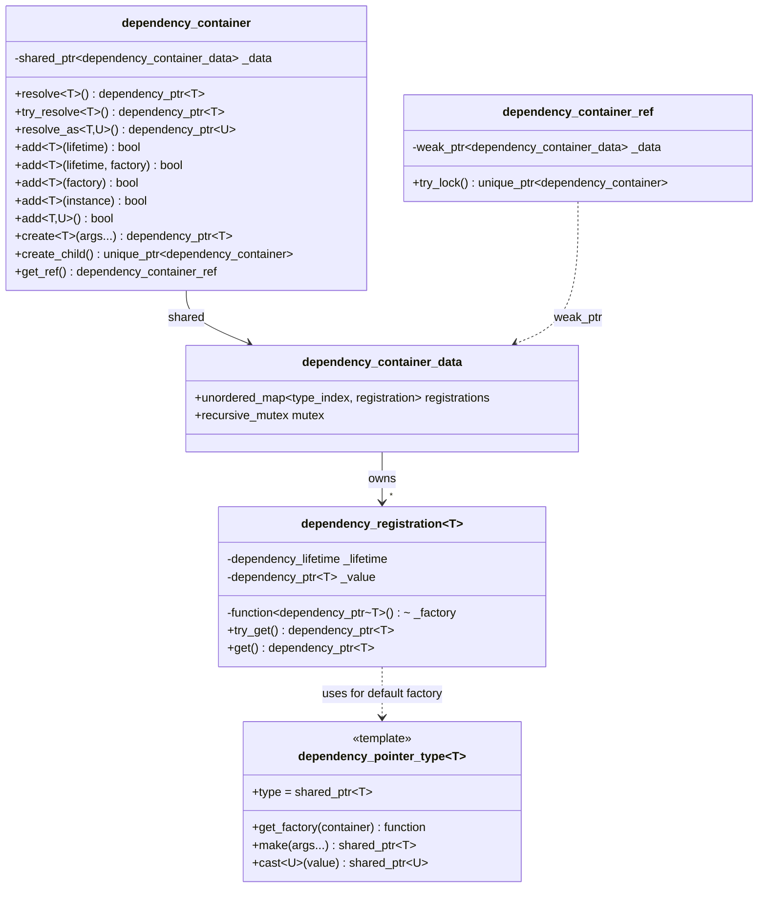

# DependencyContainer

`dependency_container` is a small inversion-of-control container. It builds and caches service instances, supports both singleton and transient lifetimes, lets services declare dependencies through a constructor that takes a `dependency_container*`, and produces child containers that inherit registrations from their parent.

The whole module weighs in at one header and one tiny `.cpp` — the container is intentionally minimal. There is no scope tree, no decorator chain, no lifecycle hooks beyond construction.

## Purpose

In practice the container is used to:

- Wire long-lived application services (an `event_aggregator`, a settings store, a repository) once and resolve them from anywhere.
- Decouple consumer construction from the construction order of providers — call sites only depend on the interface they ask for, not on who builds it.
- Plug in alternative implementations (test doubles, platform-specific variants) by registering an instance or a factory before the first `resolve<T>()` call.
- Spawn isolated child containers that share the parent's registrations but can override them locally.

## Architecture



A few moving parts worth highlighting:

- **`dependency_pointer_type<T>`** decides how a registered type is held. The default is `std::shared_ptr<T>`; a Windows-only specialization for WinRT projection types holds the value directly (see [WinRtDependencies](WinRtDependencies.md)). Specialise this template if your service has unusual ownership requirements.
- **The default factory uses three traits.** When you register a type without supplying a factory, `dependency_pointer_type<T>::get_factory(container)` picks one of:
  - `std::make_shared<T>()` if `T` is default-constructible (`supports_new<T>`),
  - `std::make_shared<T>(container)` if `T` has a constructor that takes a `dependency_container*` (`expects_dependency_container<T>`),
  - a factory that produces `nullptr` otherwise.
- **`add` returns `bool` indicating "newly added"**. If a registration for the type already exists it is left untouched. To replace a registration, you typically construct a fresh container or a child.
- **Optional process-wide instance.** When a consumer defines `USE_GLOBAL_DEPENDENCIES`, `Infrastructure::dependencies` is exposed as an `extern dependency_container`. Otherwise create one explicitly and pass it around.

## Code examples

### Resolving with sensible defaults

The simplest case: no explicit registration, no constructor argument. The container default-constructs the singleton on first `resolve<T>()` and returns the same instance forever after.

```cpp
#include "Include/Axodox.Infrastructure.h"

using namespace Axodox::Infrastructure;

dependency_container container;

auto bus     = container.resolve<event_aggregator>();
auto sameBus = container.resolve<event_aggregator>();
assert(bus == sameBus);                          // same instance
```

### Letting services request the container

When a constructor takes a `dependency_container*`, the default factory passes it through automatically. This is the typical wiring pattern for application services that need to look up siblings:

```cpp
class Repository
{
public:
  explicit Repository(dependency_container* container) :
    _state(container->resolve<AppState>()),
    _events(container->resolve<event_aggregator>())
  { }

private:
  std::shared_ptr<AppState>        _state;
  std::shared_ptr<event_aggregator> _events;
};

auto repo = container.resolve<Repository>();
```

`Repository` does not need to be registered up-front — the first `resolve<Repository>()` call constructs it via the `expects_dependency_container` factory, caches it as a singleton, and returns it.

### Registering with a custom factory

`add<T>(factory)` replaces the default factory. Two factory shapes are accepted: one that builds the instance from scratch, and one that takes the container as an argument so the factory itself can resolve dependencies:

```cpp
container.add<AppState>([] {
  return std::make_shared<AppState>(LoadInitialState());
});

container.add<Repository>([](dependency_container* c) {
  return std::make_shared<Repository>(
    c->resolve<AppState>(), c->resolve<event_aggregator>());
});
```

Pair the factory with a lifetime when needed:

```cpp
container.add<TempBuilder>(dependency_lifetime::transient);
auto a = container.resolve<TempBuilder>();
auto b = container.resolve<TempBuilder>();
assert(a != b);                                  // a fresh instance per resolve()
```

### Registering an existing instance

Useful at startup when an object must be constructed early (the application object itself, a configured logger, etc.) and then handed to the container:

```cpp
auto navigation = std::make_shared<NavigationService>(/*…*/);
container.add<INavigationService>(std::static_pointer_cast<INavigationService>(navigation));
```

### Aliasing an interface to an implementation

`add<TInterface, TImpl>()` registers `TInterface` so that resolving it routes through the registration for `TImpl` and casts. Combine with a registered instance of `TImpl` to expose the same object under multiple types:

```cpp
container.add<IRepository, Repository>();
auto repo = container.resolve<IRepository>();
```

### `create<T>(args…)` — register-and-resolve in one call

`create<T>(args…)` calls `dependency_pointer_type<T>::make(args…)` and registers the result as a singleton. If a registration for `T` already exists, the new instance is discarded and the existing one is returned:

```cpp
auto state = container.create<AppState>(LoadInitialState());
```

This is the common pattern for application bootstrap: the entry point creates a few well-known services with explicit constructor arguments, and the rest of the app gets them via plain `resolve<T>()`.

### Child containers

`create_child()` returns a `unique_ptr<dependency_container>` populated with **clones** of the parent's current registrations. Singleton instances are copied — both containers see the same shared instance until one of them re-registers — but the registrations themselves are independent, so the child can swap a service for a test double without affecting the parent:

```cpp
auto child = container.create_child();
child->add<INavigationService>(std::make_shared<TestNavigationService>());
auto repo = child->resolve<Repository>();   // sees the test double
```

### Weak references with `dependency_container_ref`

When a long-lived component must outlive the container that built it (for example, a callback that may fire after the app is shut down), hold a `dependency_container_ref` instead of a `dependency_container*` and lock it on use:

```cpp
class LongLivedCallback
{
  dependency_container_ref _ref;

public:
  explicit LongLivedCallback(const dependency_container& container) :
    _ref(container.get_ref())
  { }

  void Fire()
  {
    if (auto container = _ref.try_lock())
    {
      container->resolve<event_aggregator>()->raise<SomethingHappened>();
    }
    // otherwise: container is gone, the callback is a no-op
  }
};
```

### Process-wide container

When `USE_GLOBAL_DEPENDENCIES` is defined for the consumer build, the library exposes a single `dependency_container Infrastructure::dependencies` that everyone can use:

```cpp
using namespace Axodox::Infrastructure;

dependencies.add<INavigationService>(navigation);
auto state = dependencies.resolve<AppState>();
```

This is the simplest setup for an application that wants one root scope; for libraries, prefer creating and passing a container explicitly.

## Files

| File | Contents |
| --- | --- |
| [Infrastructure/DependencyContainer.h](../../Axodox.Common.Shared/Infrastructure/DependencyContainer.h) | `dependency_container`, `dependency_container_ref`, `dependency_lifetime`, `dependency_pointer_type<T>` (default `shared_ptr` flavour) and the internal `dependency_registration<T>` template. |
| [Infrastructure/DependencyContainer.cpp](../../Axodox.Common.Shared/Infrastructure/DependencyContainer.cpp) | Defines the optional process-wide `Infrastructure::dependencies` instance when `USE_GLOBAL_DEPENDENCIES` is set. |
| [Infrastructure/WinRtDependencies.h](../../Axodox.Common.Shared/Infrastructure/WinRtDependencies.h) | Windows-only `dependency_pointer_type` specialization for WinRT projection types. See [WinRtDependencies](WinRtDependencies.md). |
| [Infrastructure/Traits.h](../../Axodox.Common.Shared/Infrastructure/Traits.h) | `supports_new<T>` — used by the default factory to decide whether `T` can be `new`-ed without arguments. |
