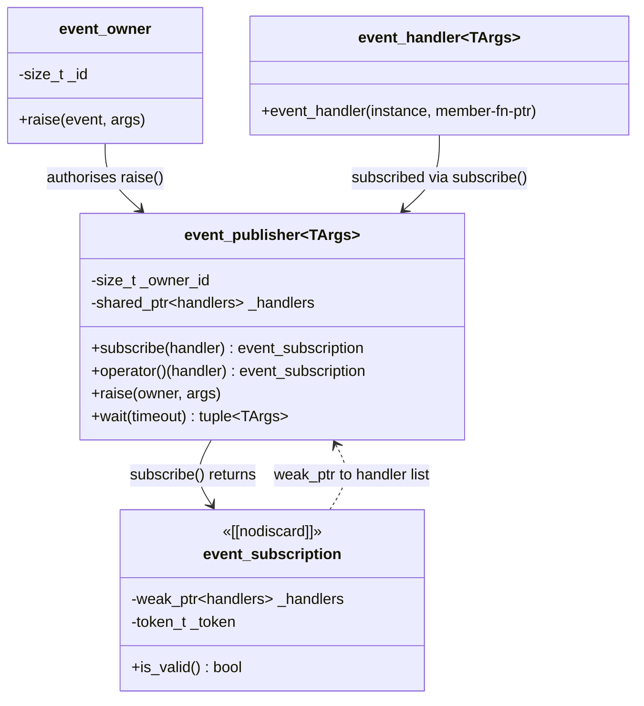

# Events

The events system is a token-based publish/subscribe primitive. Every "something happened" notification in the library — `ValueChanged`, `state_changed`, `Resized`, `Painting`, `MessageReceived`, … — is exposed as an `event_publisher<TArgs…>` that consumers can subscribe to with an `event_handler` and unsubscribe by destroying the returned `event_subscription`.

## Architecture

The system is built from four cooperating types:



Three properties of the design are worth knowing:

- **Only the owner can raise.** `event_publisher::raise(owner, args…)` checks that the supplied `event_owner`'s id matches the publisher's, and throws `std::logic_error` otherwise. This is what makes a public `event_publisher<…>` field safe to expose without giving callers the ability to spoof events.
- **Subscriptions auto-revoke by default.** `subscribe(handler)` returns an `[[nodiscard]] event_subscription`. When that token is destroyed (or moved-from) the handler is removed. To opt out — when the handler should live for the rest of the publisher's life — use `subscribe(no_revoke, handler)`.
- **The handler list is shared via `shared_ptr`.** `event_subscription` only holds a `weak_ptr` to it, so destroying the publisher first is safe; the subscription becomes inert (`is_valid() == false`).

## Code examples

### Exposing an event from your class

The owner-and-publisher pair is the standard pattern: a private `event_owner` provides identity, and one or more public `event_publisher<…>` members are constructed from it. The publisher members are conventionally listed *after* `_events` so they are initialised after the owner.

```cpp
#include "Include/Axodox.Infrastructure.h"

class MyService
{
  Axodox::Infrastructure::event_owner _events;

public:
  // Public events — anyone may subscribe, only this class may raise.
  Axodox::Infrastructure::event_publisher<MyService*>             Started{ _events };
  Axodox::Infrastructure::event_publisher<MyService*, int>        ProgressChanged{ _events };
  Axodox::Infrastructure::event_publisher<MyService*, std::string> Failed{ _events };

  void Run()
  {
    _events.raise(Started, this);

    for (int i = 0; i < 100; i++)
    {
      _events.raise(ProgressChanged, this, i);
    }
  }
};
```

### Subscribing with auto-revoke

Capture the returned `event_subscription` in a member to keep it alive for as long as the subscriber needs it. The handler is removed automatically when the subscription is destroyed:

```cpp
class StatusBar
{
  std::shared_ptr<MyService> _service;
  Axodox::Infrastructure::event_subscription _progressSub;

public:
  explicit StatusBar(std::shared_ptr<MyService> service) :
    _service(std::move(service)),
    _progressSub(_service->ProgressChanged(
      Axodox::Infrastructure::event_handler{ this, &StatusBar::OnProgress }))
  { }

private:
  void OnProgress(MyService*, int progress)
  {
    UpdateUi(progress);
  }
};
```

`publisher(handler)` is shorthand for `publisher.subscribe(handler)` — the call-operator overload is the more common form in the codebase.

### Method handler vs. lambda handler

`event_handler<TArgs…>` accepts both forms. The `{ instance, &Class::Method }` constructor is the most common; lambdas work too:

```cpp
auto sub1 = service->ProgressChanged(
  Axodox::Infrastructure::event_handler{ this, &MyClass::OnProgress });

auto sub2 = service->ProgressChanged(
  [&](MyService*, int progress) { logger.log(log_severity::information, "{}%", progress); });
```

### Subscribing without auto-revoke

Use `no_revoke` when the handler must live for the whole lifetime of the publisher and you don't want to manage the subscription token. The library uses this pattern internally for the chained property-changed events on persistent state objects:

```cpp
using namespace Axodox::Infrastructure;

state.ValueChanged(no_revoke, event_handler{ this, &MyState::OnStateChanged });
```

There is no way to undo a `no_revoke` subscription — only the destruction of the publisher itself removes it. Reach for it sparingly.

### Waiting on an event

`event_publisher::wait(timeout)` blocks the caller until the next firing of the event and returns the arguments as a `std::tuple<TArgs…>`. Useful in tests, command-line tools, or any place a coroutine isn't appropriate:

```cpp
auto [sender, progress] = service->ProgressChanged.wait(
  Axodox::Threading::event_timeout{ 5000 });
```

A timeout of `event_timeout::zero()` short-circuits and returns a default-constructed tuple immediately.

## Files

| File | Contents |
| --- | --- |
| [Infrastructure/Events.h](../../Axodox.Common.Shared/Infrastructure/Events.h) | `event_owner`, `event_publisher<TArgs…>`, `event_handler<TArgs…>`, `[[nodiscard]] event_subscription`, the `no_revoke` opt-out tag, and the underlying `event_handler_collection` glue. |
| [Threading/Events.h](../../Axodox.Common.Shared/Threading/Events.h) / [.cpp](../../Axodox.Common.Shared/Threading/Events.cpp) | Used internally by `event_publisher::wait` — `manual_reset_event` and the `event_timeout` typedef. See the [Threading](../Threading.md) document. |
