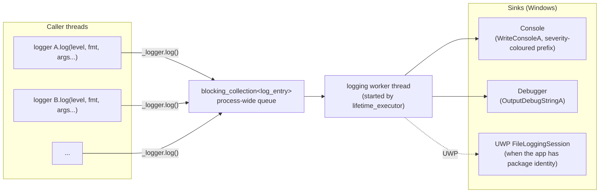

# Logger and Stopwatch

The library ships a tiny but capable channel-based logger. Every component that writes diagnostics declares a `static const logger _logger{ "ComponentName" }` instance and routes everything through `std::format`-style overloads. Writes are non-blocking — log entries are pushed onto a `blocking_collection<log_entry>` and a single background worker thread serializes them out to console / debugger / UWP file logs.

`Stopwatch` is a small RAII helper that uses the logger to print elapsed times when it goes out of scope.

## Architecture



Key properties:

- **Channel name is fixed at construction.** Each `logger` instance carries one `std::string_view` channel name, intended to live for the lifetime of the program (typically a `static const` data member).
- **Severity threshold is process-wide.** `logger::severity()` returns the global threshold; `logger::severity(value)` raises or lowers it. Every entry below the threshold is dropped at the call site, before being formatted.
- **Two formatted overloads — narrow and wide.** Both `std::format_string<TArgs…>` and `std::wformat_string<TArgs…>` are accepted; the wide variant routes through `winrt::to_string` and ends up in the UTF-8 pipeline.
- **Producer/consumer is non-blocking.** `log()` only takes the formatting time and a queue push; the actual I/O happens on the worker thread, so logging from a hot path stays cheap.
- **Worker lifetime is automatic.** A `lifetime_executor<initialize_logger, shutdown_logger>` in an anonymous namespace starts the worker on first translation-unit init and stops it on shutdown. There is no explicit `Logger::Initialize()` call to make.

## `logger`

### Declaring a logger instance

The convention is one `static const` logger per class or component, named after the component:

```cpp
class MyService
{
  inline static Axodox::Infrastructure::logger _logger{ "MyService" };
  // …
};
```

Free-function code paths can also declare a file-scope instance:

```cpp
namespace
{
  Axodox::Infrastructure::logger _logger{ "main" };
}
```

### Logging messages

Call `log(severity, format, args…)` with a severity from `log_severity` (`debug`, `information`, `warning`, `error`, `fatal`) and a `std::format`-style format string:

```cpp
using namespace Axodox::Infrastructure;

_logger.log(log_severity::information, "Initializing...");
_logger.log(log_severity::information, "Launched with {} argument(s).", argc);
_logger.log(log_severity::error, "Failed to load {}.", componentName);
```

Plain `std::string_view` and `std::wstring_view` overloads are also available for cases where the message is already assembled.

### Setting the severity threshold

Lower the threshold at startup to enable verbose logging, or raise it in production builds to drop debug noise:

```cpp
Axodox::Infrastructure::logger::severity(log_severity::information);
```

The threshold is a single atomic-ish global; flipping it affects every logger in the process from the next call onward.

### Output sinks (Windows)

When running on Windows, every entry is sent both to the console (with a severity-coloured prefix) and to the debugger via `OutputDebugStringA`. UWP apps with package identity additionally get a `Windows.Foundation.Diagnostics.FileLoggingSession` per channel, so log files can be inspected through standard ETW tooling.

## `Stopwatch`

`Stopwatch` is a one-line RAII timer. Construct it with a label; the destructor logs `"{label}: {elapsed} ms"` at `debug` severity through the dedicated `"Stopwatch"` channel:

```cpp
{
  Axodox::Infrastructure::Stopwatch sw{ "load model" };
  LoadModel(path);
}                                                // logs "load model: 123.45 ms" at debug level
```

Because the message goes through the regular logger, it is gated by the process-wide severity threshold — flip the threshold to `debug` to see stopwatch output, or leave it at `information` to suppress it.

> Note: `Stopwatch` is one of the few PascalCase types in the otherwise snake_case Infrastructure module — see the [Coding conventions](../Conventions.md) for the rule.

## Files

| File | Contents |
| --- | --- |
| [Infrastructure/Logger.h](../../Axodox.Common.Shared/Infrastructure/Logger.h) | `log_severity` enum, the `logger` class with narrow and wide `std::format`-style overloads, and the static severity threshold accessors. |
| [Infrastructure/Logger.cpp](../../Axodox.Common.Shared/Infrastructure/Logger.cpp) | Worker thread, the `blocking_collection<log_entry>` queue, the console / debugger / UWP sinks, and the `lifetime_executor` that starts/stops the worker. |
| [Infrastructure/Stopwatch.h](../../Axodox.Common.Shared/Infrastructure/Stopwatch.h) / [.cpp](../../Axodox.Common.Shared/Infrastructure/Stopwatch.cpp) | RAII labelled timer that logs its lifetime on destruction at `debug` severity through the `"Stopwatch"` channel. |
| [Threading/BlockingCollection.h](../../Axodox.Common.Shared/Threading/BlockingCollection.h) | Underlying queue used between callers and the worker thread. See [Threading](../Threading.md). |
| [Threading/LifetimeExecutor.h](../../Axodox.Common.Shared/Threading/LifetimeExecutor.h) | Module init/shutdown helper used to start and stop the worker. |
