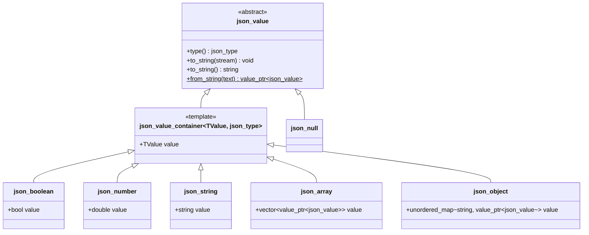
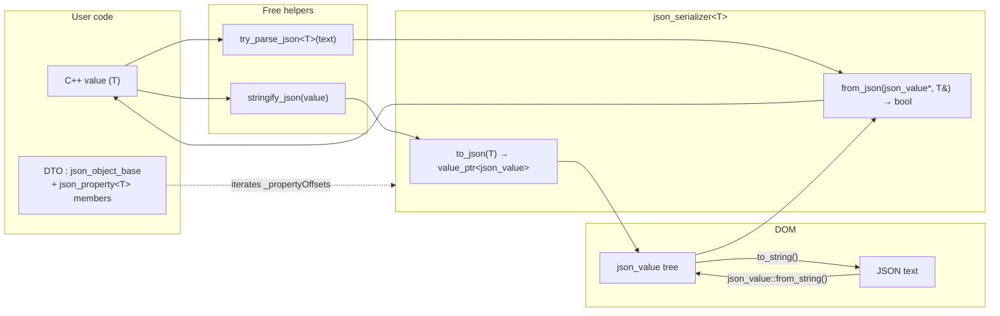

# Json

`Axodox::Json` is a small, self-contained JSON DOM and serialization layer. It parses JSON text into a tree of polymorphic value nodes, lets you serialize C++ types to/from JSON via templated `json_serializer<T>` specializations, and supports declarative property-based binding through `json_property<T>` members on classes derived from `json_object_base`.

The whole module is reachable via the umbrella header `#include "Include/Axodox.Json.h"`. Everything lives in the `Axodox::Json` namespace.

Functionality at a glance:

- DOM types for the six JSON kinds (`null`, `boolean`, `number`, `string`, `array`, `object`), all owned through `Infrastructure::value_ptr<json_value>`.
- A non-throwing recursive-descent parser entered through `json_value::from_string(text)`.
- Stringification via `json_value::to_string()` (escapes control chars in strings, double precision for numbers).
- A template `json_serializer<T>` that maps C++ values to JSON, with built-in specializations for arithmetic types, `bool`, `std::string`, `std::vector<T>`, `std::optional<T>`, `std::chrono::duration<…>`, enums (named via `named_enum` or numeric otherwise), and any class derived from `json_object_base`.
- Two free helpers: `try_parse_json<T>(text)` and `stringify_json(value)`.
- A reflection-free property registration mechanism: `json_property<T>` members on a `json_object_base` register their byte offsets at construction so the base class can iterate them at (de)serialization time.
- Polymorphic round-tripping: when a `json_object_base` exposes a `static type_registry<T> derived_types`, the serializer emits a `"$type"` discriminator and recreates the right derived class on read-back.

## Architecture

The DOM is a single-rooted polymorphic hierarchy; each concrete leaf wraps a specific C++ value type:



The serialization layer sits on top of the DOM. It is a template `json_serializer<T>` whose specializations convert C++ values to and from `json_value` subtrees. Higher-level helpers — `try_parse_json<T>`, `stringify_json`, and the `json_property<T>` / `json_object_base` pair — all funnel through it:



Three design points worth keeping in mind:

- **Ownership is `value_ptr`-based.** `Infrastructure::value_ptr<T>` is a deep-copying owning pointer — copying any DOM node clones the entire subtree.
- **Reflection-free property registration.** Each `json_property<T>` constructor pushes its `intptr_t` offset into a vector held by its owning `json_object_base`. At (de)serialization time the base class reconstructs a typed property pointer per offset and dispatches `to_json` / `from_json` through it. This is why every DTO must define a default constructor that initializes each `json_property` with `(this, "name")`.
- **Polymorphism is opt-in** via a `static Axodox::Infrastructure::type_registry<Base> derived_types` member on the abstract base. The serializer's specialization for pointer-like types whose pointee derives from `json_object_base` and exposes `derived_types` writes a `"$type"` discriminator and reconstructs the correct derived class on read-back.

## Code examples

The examples below are written generically — substitute your own type names where appropriate.

### Parsing free-form JSON

```cpp
#include "Include/Axodox.Json.h"

using namespace Axodox::Json;

std::string_view text = R"({"name":"foo","values":[1,2,3]})";
auto root = json_value::from_string(text);          // value_ptr<json_value>

if (root && root->type() == json_type::object)
{
  auto obj  = static_cast<const json_object*>(root.get());
  auto name = static_cast<const json_string*>(obj->at("name").get())->value;
}

auto roundtrip = root->to_string();                 // -> {"name":"foo","values":[1,2,3]}
```

### Declarative DTO with `json_object_base` + `json_property`

Derive a DTO from `json_object_base`, declare each field as a `json_property<T>`, and bind every property to its JSON key in the default constructor (an optional third argument supplies a default value):

```cpp
struct MyDto : public Axodox::Json::json_object_base
{
  Axodox::Json::json_property<std::string> Title;
  Axodox::Json::json_property<uint32_t>    Width;
  Axodox::Json::json_property<uint32_t>    Height;
  Axodox::Json::json_property<float>       Scale;
  Axodox::Json::json_property<bool>        Enabled;

  MyDto();
};

MyDto::MyDto() :
  Title  (this, "title"),
  Width  (this, "width"),
  Height (this, "height"),
  Scale  (this, "scale", 1.0f),       // default value
  Enabled(this, "enabled")
{ }
```

`json_property<T>` exposes the underlying value through `operator*`, `operator->`, and `get()`. Read or write a property by dereferencing it, then use the free helpers to round-trip:

```cpp
MyDto dto;
*dto.Title  = "example";
*dto.Width  = 1920;
*dto.Height = 1080;

std::string text                = stringify_json(dto);
std::optional<MyDto> roundtrip  = try_parse_json<MyDto>(text);
```

### Container and nested-DTO properties

`json_serializer<T>` already handles `std::vector<T>`, `std::optional<T>`, and any nested `json_object_base`-derived DTO:

```cpp
struct Inner : public Axodox::Json::json_object_base
{
  Axodox::Json::json_property<std::string> Path;
  Inner();
};

struct Outer : public Axodox::Json::json_object_base
{
  Axodox::Json::json_property<std::string>            Id;
  Axodox::Json::json_property<std::vector<std::string>> Tags;
  Axodox::Json::json_property<std::vector<Inner>>     Items;
  Axodox::Json::json_property<std::optional<uint32_t>> Limit;

  Outer();
};
```

A typical client call site looks like this:

```cpp
auto items = try_parse_json<std::vector<Outer>>(responseText);
if (!items) return {};

for (auto& item : *items)
{
  use(*item.Id, *item.Tags);
}
```

### Polymorphic objects via `derived_types`

Declare an abstract base that exposes a `static type_registry<Base> derived_types`, give each derived type a default constructor, and populate the registry from the variadic factory:

```cpp
struct MessageBase : public Axodox::Json::json_object_base
{
  static Axodox::Infrastructure::type_registry<MessageBase> derived_types;
  virtual int Kind() const = 0;
};

struct MessageA : public MessageBase
{
  Axodox::Json::json_property<std::string> Text;
  int Kind() const override { return 1; }
  MessageA();
};

struct MessageB : public MessageBase
{
  Axodox::Json::json_property<uint32_t> Code;
  int Kind() const override { return 2; }
  MessageB();
};

inline Axodox::Infrastructure::type_registry<MessageBase>
  MessageBase::derived_types =
    Axodox::Infrastructure::type_registry<MessageBase>::create<MessageA, MessageB>();
```

The serializer emits a `"$type"` discriminator on write and reconstructs the correct derived class on read — so you parse straight into a smart pointer to the base:

```cpp
auto message = try_parse_json<std::unique_ptr<MessageBase>>(text);
if (!message || !*message) return;

switch ((*message)->Kind())
{
  case 1: handle(static_cast<const MessageA*>(message->get())); break;
  case 2: handle(static_cast<const MessageB*>(message->get())); break;
}
```

> Tip: when the discriminator key is a `named_enum` (see the `Infrastructure` module), `"$type"` is emitted as the enum's textual name rather than its numeric index — handy for human-readable wire formats.

### Custom per-property converters

`json_property<T, TConverter>` accepts a second template parameter that overrides the default `json_serializer<T>`. The converter only needs two static functions — no inheritance required:

```cpp
struct base64_converter
{
  static Axodox::Infrastructure::value_ptr<Axodox::Json::json_value>
    to_json(const std::vector<uint8_t>& value);

  static bool from_json(const Axodox::Json::json_value* json, std::vector<uint8_t>& value);
};

struct Payload : public Axodox::Json::json_object_base
{
  Axodox::Json::json_property<std::string>                          Mime;
  Axodox::Json::json_property<std::vector<uint8_t>, base64_converter> Body;
  Payload();
};
```

This is the right tool when the JSON encoding for a single field must differ from the default — for example a `std::vector<uint8_t>` that should travel as a base64 string instead of a JSON array of numbers.

### Hand-rolling a global `json_serializer<T>` specialization

When a type should participate in the regular serialization path so that `std::vector<T>`, `std::optional<T>`, etc. work transparently, specialize the template directly:

```cpp
namespace Axodox::Json
{
  template <>
  struct json_serializer<MyType>
  {
    static Infrastructure::value_ptr<json_value> to_json(const MyType& value);
    static bool from_json(const json_value* json, MyType& value);
  };
}
```

The library already does this for arithmetic types, `bool`, `std::string`, `std::vector<T>`, `std::optional<T>`, `std::chrono::duration<…>`, enums, and `json_object_base`-derived classes — most user code never needs to.

## Files

| File | Role |
| --- | --- |
| [Include/Axodox.Json.h](../Axodox.Common.Shared/Include/Axodox.Json.h) | Public umbrella header. Pulls in every per-feature header below. |
| [Json/JsonValue.h](../Axodox.Common.Shared/Json/JsonValue.h) / [.cpp](../Axodox.Common.Shared/Json/JsonValue.cpp) | The abstract `json_value` base, the `json_value_container<TValue, json_type>` helper, the `json_type` enum, the recursive-descent dispatcher in `json_value::from_string`, the `json_skip_whitespace` helper, and the free `try_parse_json<T>` / `stringify_json` shortcuts. Also forward-declares the empty primary template `json_serializer<T>`. |
| [Json/JsonNull.h](../Axodox.Common.Shared/Json/JsonNull.h) / [.cpp](../Axodox.Common.Shared/Json/JsonNull.cpp) | `json_null` literal, parses/emits `null`. |
| [Json/JsonBoolean.h](../Axodox.Common.Shared/Json/JsonBoolean.h) / [.cpp](../Axodox.Common.Shared/Json/JsonBoolean.cpp) | `json_boolean` (`bool`), parses `true` / `false`, plus `json_serializer<bool>`. |
| [Json/JsonNumber.h](../Axodox.Common.Shared/Json/JsonNumber.h) / [.cpp](../Axodox.Common.Shared/Json/JsonNumber.cpp) | `json_number` (stored as `double`, parsed via `std::from_chars`). Also defines `json_serializer<T>` for any arithmetic type, for `std::chrono::duration<…>` (serialized as its `count()`), and for enums (string when `named_enum_serializer<T>::exists()`, numeric otherwise). |
| [Json/JsonString.h](../Axodox.Common.Shared/Json/JsonString.h) / [.cpp](../Axodox.Common.Shared/Json/JsonString.cpp) | `json_string` with manual escape handling for `"\\\\\\r\\n\\t\\0`. Also `json_serializer<std::string>`, an automatic specialization for any type constructible from `std::string`, and one for types that satisfy `Infrastructure::supports_to_from_string`. |
| [Json/JsonArray.h](../Axodox.Common.Shared/Json/JsonArray.h) / [.cpp](../Axodox.Common.Shared/Json/JsonArray.cpp) | `json_array` over `std::vector<value_ptr<json_value>>`, plus a generic `json_serializer<std::vector<T>>` that recurses into the element serializer. |
| [Json/JsonObject.h](../Axodox.Common.Shared/Json/JsonObject.h) / [.cpp](../Axodox.Common.Shared/Json/JsonObject.cpp) | `json_object` over `std::unordered_map<std::string, value_ptr<json_value>>`, with `at` / `operator[]`, typed `set_value<T>` / `get_value<T>` / `try_get_value` helpers that route through `json_serializer<T>`. |
| [Json/JsonSerializer.h](../Axodox.Common.Shared/Json/JsonSerializer.h) / [.cpp](../Axodox.Common.Shared/Json/JsonSerializer.cpp) | The `json_property_base` / `json_property<T, TConverter>` / `json_object_base` triumvirate, plus the two big specializations of `json_serializer`: one for any class deriving from `json_object_base` (walks `_propertyOffsets`), and one for pointer-like types whose pointee derives from `json_object_base` and exposes a `derived_types` registry — implementing `"$type"`-discriminated polymorphic round-tripping. Also a specialization for `std::optional<T>`. |
