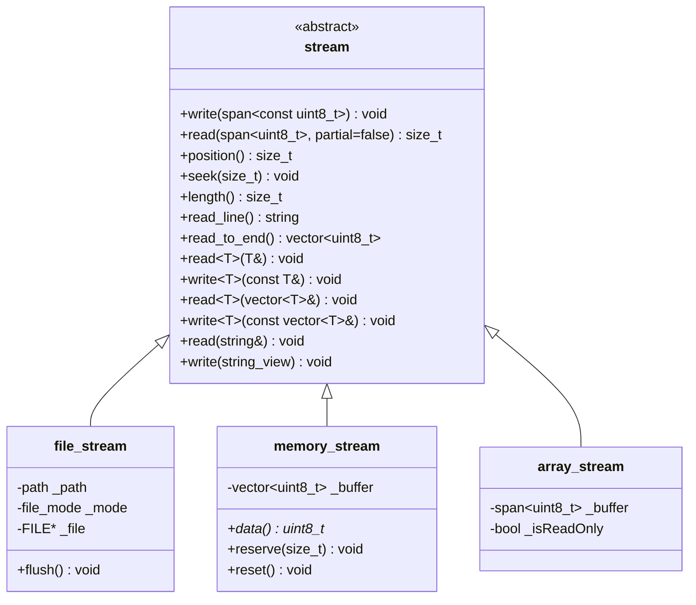
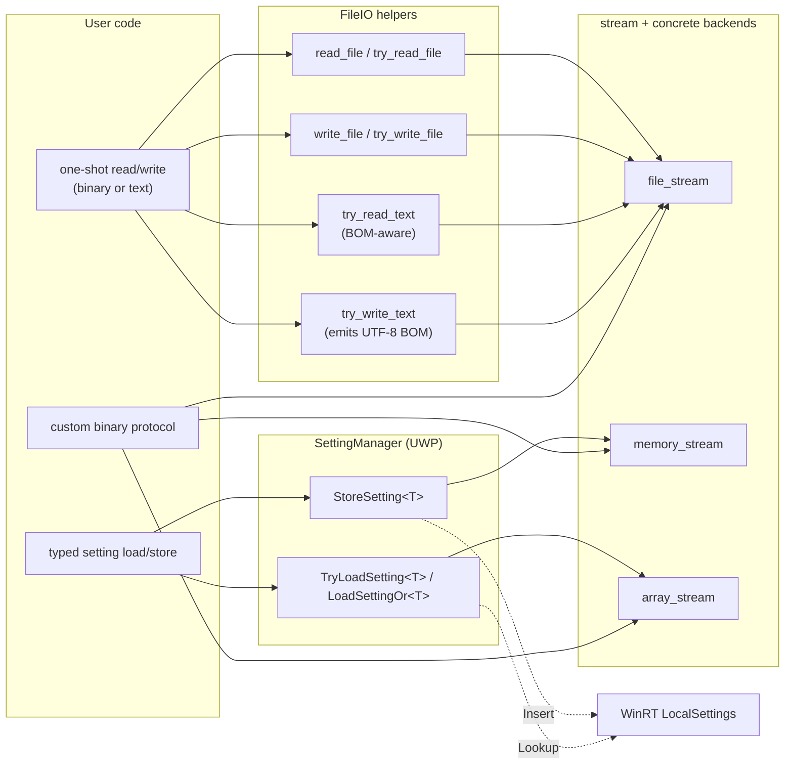

# Storage

`Axodox::Storage` is the I/O module. It provides a small `stream` abstraction with three concrete backends (file, in-memory growable, fixed-size array view), free helpers for one-shot file read/write of binary blobs and text (with BOM-aware UTF-8 / UTF-16LE handling), discovery of the application and library folders, a Windows-only WinRT `SettingManager` that round-trips values through the stream API, plus a couple of WinRT/COM bridges.

The whole module is reachable via the umbrella header `#include "Include/Axodox.Storage.h"`. Everything lives in the `Axodox::Storage` namespace.

Functionality at a glance:

- **`stream`** — abstract base with raw `read` / `write` over `std::span<uint8_t>`, plus templated overloads for trivially-copyable values, `std::vector<T>`, `std::string`, and `std::string_view` (length-prefixed for the variable-length forms).
- **Three concrete streams** — `file_stream`, `memory_stream`, `array_stream`.
- **Free file helpers** — `read_file` / `try_read_file`, `write_file` / `try_write_file`, `try_read_text` / `try_write_text`.
- **Folder discovery (Windows)** — `app_folder()` (executable directory) and `lib_folder()` (DLL directory; defined inline in the header so it resolves in the calling module).
- **`SettingManager` (UWP / WinRT)** — typed key/value persistence backed by `Windows.Storage.ApplicationData.LocalSettings`, serializing arbitrary trivially-copyable values via `memory_stream` / `array_stream`.
- **WinRT helpers (Windows)** — `read_file` overload for `Windows::Storage::StorageFile`, `read_files_recursively` for `StorageFolder`, and `to_stream(std::span<const uint8_t>)` to wrap a byte span as an `IStream`.

## Architecture

The stream hierarchy is a small classical inheritance tree. The base class adds typed conveniences on top of the raw byte interface:



The free file helpers, `SettingManager`, and the WinRT bridges all sit on top of these streams:



A few design points to note:

- **Typed `read` / `write` are length-prefixed for variable-size values.** The `std::vector<T>` and `std::string` overloads emit a `uint32_t` length followed by the bytes, and read symmetrically. `std::string_view` writes raw bytes without a length prefix (one-way only). Use the matching overloads on both sides to round-trip cleanly.
- **`partial = false` reads throw on short reads.** A trailing `bool partial = true` argument lets you take whatever is available without raising. `read_line()` and `read_to_end()` use the partial path internally.
- **`text_encoding` detection in `try_read_text` is based on the BOM.** UTF-8 (`EF BB BF`) and UTF-16LE (`FF FE`) are recognised; anything else is assumed UTF-8. `try_write_text` always emits a UTF-8 BOM.
- **`lib_folder()` lives in the header on purpose.** It uses `GetModuleHandleEx(GET_MODULE_HANDLE_EX_FLAG_FROM_ADDRESS, …)` and must be inlined into the calling module to resolve to the right DLL/EXE.
- **`SettingManager` is a thin WinRT facade.** Each setting is stored as a `Windows.Foundation.PropertyValue.UInt8Array`. `StoreSetting<T>` writes through a `memory_stream`; `TryLoadSetting<T>` reads back through an `array_stream`. The type must be supported by `stream::write<T>` (trivially-copyable, or `std::vector<T>` of trivially-copyable, or `std::string`).

## Code examples

The examples below are written generically — substitute your own paths and types.

### One-shot binary file I/O

The lowest-friction read/write path is the free helper pair. The throwing variants raise on missing files / I/O errors; the `try_` variants swallow and return empty / `false`:

```cpp
#include "Include/Axodox.Storage.h"

using namespace Axodox::Storage;

// throws on failure
write_file(path, std::span<const uint8_t>{ data });
auto bytes = read_file(path);

// non-throwing
if (!try_write_file(path, std::span<const uint8_t>{ data }))
{
  // handle persistence error
}

auto bytes_or_empty = try_read_file(path);  // empty vector on miss
```

### One-shot text file I/O

`try_read_text` peeks at the BOM and decodes UTF-8 or UTF-16LE; `try_write_text` emits a UTF-8 BOM and writes raw bytes:

```cpp
auto text = try_read_text(path);                      // std::optional<std::string>
if (text)
{
  parse_config(*text);
}

try_write_text(path, R"({"hello":"world"})");
```

### Folder discovery

`app_folder()` returns the directory of the running executable; `lib_folder()` returns the directory of the DLL where the call is compiled (use this from inside a library to find files shipped beside it):

```cpp
auto exeDir   = app_folder();                         // …\bin\
auto myDllDir = lib_folder();                         // …\bin\plugins\

auto resourcePath = lib_folder() / "resources" / "shader.cso";
auto resource     = read_file(resourcePath);
```

### Streaming binary data

For more than one read/write per file, take a `file_stream` directly. The mode controls which operations are valid; mismatched calls throw:

```cpp
file_stream stream{ path, file_mode::read };

uint32_t header;
stream.read(header);                                  // trivially-copyable overload

std::vector<uint16_t> samples;
stream.read(samples);                                 // length-prefixed vector overload

auto rest = stream.read_to_end();
```

Writing follows the same shape:

```cpp
file_stream stream{ path, file_mode::write };

stream.write(uint32_t{ 0xCAFEBABE });
stream.write(std::vector<uint16_t>{ 1, 2, 3, 4 });    // emits length, then bytes
stream.write(std::string_view{ "trailing-text" });    // raw, no length prefix
```

`file_mode::read_write` enables the same stream for both directions; `seek` / `position` / `length` require it.

### In-memory accumulation with `memory_stream`

`memory_stream` grows on write and exposes its buffer through implicit conversions and `data()`. Use it whenever you want to assemble bytes in memory and hand them off:

```cpp
memory_stream out;
out.reserve(initialCapacity);

out.write(uint32_t{ version });
out.write(std::vector<float>{ 1.0f, 2.0f, 3.0f });
out.write(std::string_view{ "footer" });

std::span<const uint8_t> bytes = out;                 // implicit
std::vector<uint8_t>     owned = std::move(out);      // rvalue conversion
```

### Read-only views with `array_stream`

`array_stream` adapts an existing buffer (`std::span<const uint8_t>` or `std::span<uint8_t>`) without copying — handy for parsing bytes you already received over the network or from a file you read in one shot:

```cpp
auto buffer = read_file(path);
array_stream in{ std::span<const uint8_t>(buffer) };

uint32_t version;
in.read(version);

std::string label;
in.read(label);
```

The `std::span<uint8_t>` constructor produces a writable view over the same bytes; the `std::span<const uint8_t>` constructor marks the stream read-only and throws on write attempts.

### Persisting typed settings (UWP)

`SettingManager` wraps `LocalSettings` so any value supported by the stream's typed `write<T>` round-trips by key. Resolve it once (typically through the dependency container) and call the typed methods:

```cpp
#ifdef WINRT_Windows_Storage_H
SettingManager settings;

settings.StoreSetting("window.width",  uint32_t{ 1280 });
settings.StoreSetting("window.height", uint32_t{ 720  });
settings.StoreSetting("user.name",     std::string{ "Alice" });

uint32_t width  = settings.LoadSettingOr("window.width",  uint32_t{ 1024 });
uint32_t height = settings.LoadSettingOr("window.height", uint32_t{ 768  });

std::string name;
if (settings.TryLoadSetting("user.name", name)) { /* … */ }

if (settings.HasSetting("legacy.flag")) settings.RemoveSetting("legacy.flag");
#endif
```

A common pattern is to layer a tiny "persistent property" type over `SettingManager` so that assigning to the property both updates the in-memory value and writes it back to local settings — see the `OptionProperty` / `PersistentOptionProperty` pair in the consumer repos for one realisation of this pattern.

### WinRT bridges

When interop is needed, two helpers smooth the WinRT side:

```cpp
#ifdef WINRT_Windows_Storage_H
// Read a StorageFile end-to-end into a byte vector.
auto bytes = read_file(storageFile);

// Walk a folder tree and collect every file.
std::vector<winrt::Windows::Storage::StorageFile> files;
co_await read_files_recursively(rootFolder, files);
#endif

// Wrap an existing byte span as a COM IStream (e.g. for WIC, Direct2D, etc.).
auto comStream = to_stream(std::span<const uint8_t>(buffer));
```

## Files

| File | Role |
| --- | --- |
| [Include/Axodox.Storage.h](../Axodox.Common.Shared/Include/Axodox.Storage.h) | Public umbrella header. Pulls in every per-feature header below; the WinRT-only ones (`UwpStorage`, `SettingManager`, `ComHelpers`) are guarded by `PLATFORM_WINDOWS`. |
| [Storage/Stream.h](../Axodox.Common.Shared/Storage/Stream.h) / [.cpp](../Axodox.Common.Shared/Storage/Stream.cpp) | Abstract `stream` base. Pure virtuals for raw `read` / `write` / `position` / `seek` / `length`; templated typed overloads for trivially-copyable values, `std::vector<T>`, `std::string`, and `std::string_view` (length-prefixed for variable-length forms). Also `read_line()` and `read_to_end()`. |
| [Storage/FileStream.h](../Axodox.Common.Shared/Storage/FileStream.h) / [.cpp](../Axodox.Common.Shared/Storage/FileStream.cpp) | `file_stream` over a `FILE*` (opened with `_wfopen_s`) and the `file_mode` flag enum (`none` / `read` / `write` / `read_write`). Move-only; mode-checked operations throw on misuse. Adds `path()` and `flush()`. |
| [Storage/MemoryStream.h](../Axodox.Common.Shared/Storage/MemoryStream.h) / [.cpp](../Axodox.Common.Shared/Storage/MemoryStream.cpp) | `memory_stream` backed by `std::vector<uint8_t>`. Auto-grows on write; implicit conversions to `std::span<uint8_t>`, `std::span<const uint8_t>`, and `std::vector<uint8_t>&&`; `data()` / `reserve()` / `reset()` helpers. |
| [Storage/ArrayStream.h](../Axodox.Common.Shared/Storage/ArrayStream.h) / [.cpp](../Axodox.Common.Shared/Storage/ArrayStream.cpp) | `array_stream` adapting a fixed `std::span`. Two constructors: writable (`std::span<uint8_t>`) and read-only (`std::span<const uint8_t>`); writes to a read-only view throw. |
| [Storage/FileIO.h](../Axodox.Common.Shared/Storage/FileIO.h) / [.cpp](../Axodox.Common.Shared/Storage/FileIO.cpp) | Free-function file helpers: `read_file` / `try_read_file`, `write_file` / `try_write_file`, BOM-aware `try_read_text`, BOM-emitting `try_write_text`. Windows-only `app_folder()` (executable directory). `lib_folder()` is inline in the header so it resolves to the calling module. |
| [Storage/SettingManager.h](../Axodox.Common.Shared/Storage/SettingManager.h) / [.cpp](../Axodox.Common.Shared/Storage/SettingManager.cpp) | UWP-only typed key/value store over `Windows.Storage.ApplicationData.LocalSettings`. `StoreSetting<T>` serializes via `memory_stream`; `TryLoadSetting<T>` / `LoadSettingOr<T>` deserialize via `array_stream`. Header is gated by `WINRT_Windows_Storage_H`. |
| [Storage/UwpStorage.h](../Axodox.Common.Shared/Storage/UwpStorage.h) | Windows-only WinRT helpers: `read_file(StorageFile)` and `read_files_recursively(StorageFolder, …)`. Header is gated by `WINRT_Windows_Storage_H`. |
| [Storage/ComHelpers.h](../Axodox.Common.Shared/Storage/ComHelpers.h) / [.cpp](../Axodox.Common.Shared/Storage/ComHelpers.cpp) | Windows-only COM bridge: `to_stream(std::span<const uint8_t>)` returns a `winrt::com_ptr<IStream>` wrapping the bytes. |
