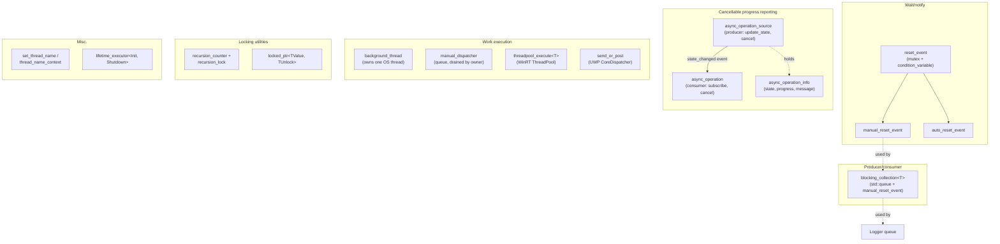

# Threading

`Axodox::Threading` collects the synchronization primitives, work-execution helpers, and concurrency utilities used across the rest of the library. It builds on `std::mutex` / `std::condition_variable` rather than replacing them — most types are thin RAII wrappers around standard primitives plus a few platform glue layers for Windows / WinRT thread pools and UWP dispatchers.

The whole module is reachable via the umbrella header `#include "Include/Axodox.Threading.h"`. Everything lives in the `Axodox::Threading` namespace.

Functionality at a glance:

- **Synchronization events** — `manual_reset_event` and `auto_reset_event` (a `wait` / `set` / `reset` API on top of `std::condition_variable`), plus an `event_timeout` typedef for millisecond timeouts.
- **Producer/consumer queue** — `blocking_collection<T>` (header-only, in `Threading/BlockingCollection.h`) backed by `std::queue<T>` plus a `manual_reset_event`.
- **Cancellable progress-bearing operations** — `async_operation_source` (the producer side: progress / status / cancellation flag) and `async_operation` (the consumer side: subscribes to state changes, can request cancellation).
- **Work pumps** — `manual_dispatcher` (a thread-agnostic queue that runs callbacks when the owner calls `process_pending_invocations()`) and the WinRT `threadpool_execute<T>` shortcut that wraps an action into `Windows.System.Threading.ThreadPool` and returns a `std::future<T>`.
- **Long-lived workers (Windows)** — `background_thread` owns one OS thread, runs a single action callback, and tears it down on destruction. Cooperative shutdown is signalled via `is_exiting()`.
- **Thread naming (Windows / Linux)** — `set_thread_name`, `get_thread_name`, and the RAII `thread_name_context` that scopes a temporary rename.
- **UWP dispatcher helper** — `send_or_post(CoreDispatcher, action)` runs the action synchronously when invoked on the dispatcher's thread, and posts otherwise.
- **Recursion-aware locks** — `recursion_counter` + `[[nodiscard]] recursion_lock` for guarding code paths that may re-enter themselves.
- **Read-locked smart pointer** — `locked_ptr<TValue, TUnlock>` couples a `std::shared_lock<std::shared_mutex>` with a value pointer so the lock survives exactly as long as the pointer.
- **Module init/shutdown helper** — `lifetime_executor<FInitialize, FShutdown>` is a static-storage RAII pair used in anonymous namespaces of `.cpp` files to register process-lifetime startup and teardown hooks.

## Architecture

The module isn't a single hierarchy — it's a few independent toolkits that compose. The diagram below groups them by purpose:



A few design points worth knowing:

- **`reset_event::wait` returns `bool`**, where `false` means the timeout elapsed without a signal. A default-constructed timeout (`event_timeout{}` or `chrono::steady_clock::duration{}`) means *wait forever*.
- **`async_operation_source` is the producer; `async_operation` is the consumer.** A worker function takes an `async_operation_source&`, drives `update_state(...)`, and periodically calls `throw_if_cancelled()`. The caller owns an `async_operation`, calls `set_source(...)` once, and reacts to `state_changed` updates. `is_cancelled` is a plain `bool` flag — cancellation is cooperative.
- **`blocking_collection<T>::try_get`** blocks until either an item is available, the timeout elapses, or `complete()` is called. The destructor calls `complete()`, making the queue safe to use as a member of a long-lived owner.
- **`background_thread` shutdown is cooperative.** The worker loop should poll `is_exiting()` (or sleep with timeouts) and exit promptly. The destructor sets the flag and joins; never detach the thread.
- **`manual_dispatcher` does not have its own thread.** It is meant to be drained on a thread the user controls — for example, a UI thread per frame, a render-loop turn, or the message-pump tick of a game loop.
- **`lifetime_executor` is the canonical pattern for module-scope init/shutdown.** Place a `static lifetime_executor<initialize_xxx, shutdown_xxx> xxx_executor;` at the bottom of an anonymous namespace in your `.cpp` and the constructor / destructor will run during DLL load / unload.

## Code examples

### Cancellable progress-bearing operations

The `async_operation` pair is the canonical way the library expresses long-running work that needs to report progress and be cancellable. The producer drives an `async_operation_source`; the consumer holds an `async_operation` and binds the two with `set_source`:

```cpp
#include "Include/Axodox.Threading.h"

using namespace Axodox::Threading;

// Producer side — the worker function
std::vector<Result> RunWork(const Request& request, async_operation& operation)
{
  async_operation_source async;
  operation.set_source(async);

  try
  {
    async.update_state(NAN, "Initializing...");
    Initialize(request);

    for (size_t i = 0; i < total; i++)
    {
      async.throw_if_cancelled();
      async.update_state(float(i) / total, "Processing item " + std::to_string(i));
      ProcessOne(request, i);
    }

    async.update_state(async_operation_state::succeeded, 1.f, "Done.");
    return CollectResults();
  }
  catch (const std::exception& e)
  {
    async.update_state(async_operation_state::failed, e.what());
    return {};
  }
}

// Consumer side — the caller
async_operation operation;
operation.state_changed(Axodox::Infrastructure::no_revoke,
  [](const async_operation_info& info)
  {
    UpdateProgressBar(info.progress);
    SetStatusText(info.status_message);
  });

auto results = RunWork(request, operation);

// Cancellation can happen at any time from any thread:
operation.cancel();
```

`update_state` has four overloads — pick whichever combination of `state` / `progress` / `message` you need; passing `NAN` for `progress` or an empty string for `message` leaves that field unchanged.

### Wait/notify between threads with reset events

`manual_reset_event` stays signalled until something calls `reset()`; `auto_reset_event` resets itself the instant a single waiter is released:

```cpp
manual_reset_event ready;          // gate that opens once and stays open
auto_reset_event   workItem;       // wake one consumer per signal

// Producer
PrepareData();
ready.set();                       // unblocks every waiter

// Consumer
if (!ready.wait(event_timeout{ 5000 }))   // false on timeout
{
  HandleTimeout();
  return;
}
ConsumeData();
```

Pass an empty `event_timeout{}` (the default) to wait indefinitely.

### Producer/consumer queues with `blocking_collection<T>`

`blocking_collection<T>` is the bounded-wait queue used internally by the library's logger. The producer calls `add`; the consumer drains with `try_get` until the queue is `complete()`:

```cpp
blocking_collection<WorkItem> queue;

// Producer
queue.add(WorkItem{ /* … */ });
// …
queue.complete();                  // signal end-of-stream; destructor also calls this

// Consumer (typically on a worker thread)
WorkItem item;
while (queue.try_get(item))
{
  Process(item);
}
```

`try_get` accepts an `event_timeout` — useful when the consumer also needs to poll a separate cancellation flag. With the default zero timeout it blocks until an item arrives or the queue completes.

### Long-lived background workers

`background_thread` owns one Windows OS thread, runs a single action, names the thread, and routes uncaught exceptions through the library logger. The worker should poll `is_exiting()` or sleep with timeouts so that the destructor's join is fast:

```cpp
class StateRefresher
{
  Axodox::Threading::background_thread _worker;

public:
  StateRefresher() :
    _worker({ this, &StateRefresher::Run }, "state refresher")
  { }

private:
  void Run()
  {
    while (!_worker.is_exiting())
    {
      std::this_thread::sleep_for(std::chrono::seconds{ 1 });
      RefreshOnce();
    }
  }
};
```

The `event_handler<>{ this, &StateRefresher::Run }` form is the same one used by the events system — a method pointer plus an instance.

### One-shot work on the WinRT thread pool

`threadpool_execute<T>` packages an action into the WinRT `ThreadPool` and gives back a `std::future<T>`. Use it when you need to fire-and-forget or to await a result without managing a thread directly:

```cpp
#ifdef WINRT_Windows_System_Threading_H
auto future = threadpool_execute<int>([] {
  return ComputeExpensive();
});

int result = future.get();         // blocks until done; rethrows worker exceptions
#endif
```

### Pumping callbacks on a thread you own

`manual_dispatcher` is a queue of `std::packaged_task<void()>` items. Anyone can call `invoke_async`; the owning thread drains the queue at a chosen point (game tick, frame end, message-pump turn). Combined with `co_await future`, it acts like a hand-rolled "marshal back to my thread" facility:

```cpp
manual_dispatcher dispatcher;

// Anywhere — typically from a worker thread
auto future = dispatcher.invoke_async([] {
  UpdateUiState();                 // runs on the dispatcher's thread
});

// On the owning thread, in the per-frame loop
dispatcher.process_pending_invocations();
```

### Marshalling onto the UWP UI thread

`send_or_post` is the WinRT-friendly variant: synchronous when already on the dispatcher's thread, posted otherwise. Useful for cross-thread UI mutations from non-coroutine code paths:

```cpp
#ifdef WINRT_Windows_UI_Core_H
send_or_post(uiDispatcher, [&] { textBlock.Text(L"Done"); });
#endif
```

### Recursion-aware locks

`recursion_counter` does not own a mutex — it just counts how many `recursion_lock`s currently exist. Use it when a function may be called recursively (or re-entrantly through events) and you want to guard a critical region only on the outermost entry:

```cpp
class StateMachine
{
  Axodox::Threading::recursion_counter _updating;

public:
  void Update()
  {
    if (_updating.is_locked()) return;          // skip nested re-entry
    auto lock = _updating.lock();

    NotifyObservers();                          // may call back into Update()
  }
};
```

`recursion_lock` is `[[nodiscard]]`; the count decrements when it goes out of scope.

### Coupling a value pointer to a shared lock

`locked_ptr<T>` carries a `std::shared_lock<std::shared_mutex>` together with a `T*`. The lock is held for exactly as long as the pointer is alive, so callers can't accidentally outlive the lock:

```cpp
class Cache
{
  std::shared_mutex _mutex;
  Entry             _entry;

public:
  Axodox::Threading::locked_ptr<const Entry> Read()
  {
    return { _mutex, &_entry };                 // reader takes the shared_lock
  }
};

if (auto handle = cache.Read())                 // shared_lock held while in scope
{
  use(handle->field);
}
```

The optional second template parameter `TUnlock` lets you run a custom action when the pointer is reset — useful for paired notify/unlock semantics on top of the lock.

### Scoped thread renaming

`set_thread_name` uses `SetThreadDescription` on Windows and `pthread_setname_np` on Linux. `thread_name_context` is the RAII version that restores the previous name on destruction — handy for sub-tasks within a thread that should appear under a recognisable name in a debugger / profiler:

```cpp
{
  Axodox::Threading::thread_name_context name{ "* inference" };
  RunInference();
}                                               // previous thread name restored
```

### Module-scope init / shutdown

`lifetime_executor` lets a `.cpp` register hooks that run on DLL load / unload through a static instance. The canonical pattern is a worker thread that's kicked off at first use and joined when the module unloads — this is exactly what the `Logger` does:

```cpp
namespace
{
  void initialize_module()
  {
    StartLoggingWorker();
  }

  void shutdown_module()
  {
    StopLoggingWorker();
  }

  Axodox::Threading::lifetime_executor<initialize_module, shutdown_module> module_executor;
}
```

Either pointer may be `nullptr` if only one direction is needed.

## Files

| File | Role |
| --- | --- |
| [Include/Axodox.Threading.h](../Axodox.Common.Shared/Include/Axodox.Threading.h) | Public umbrella header. Pulls in every per-feature header below; the Windows-only ones (`UwpThreading`, `BackgroundThread`, `ThreadPool`) are guarded by `PLATFORM_WINDOWS`. |
| [Threading/Events.h](../Axodox.Common.Shared/Threading/Events.h) / [.cpp](../Axodox.Common.Shared/Threading/Events.cpp) | The `reset_event` base, its `manual_reset_event` / `auto_reset_event` derivatives, and the `event_timeout` typedef (`std::chrono::duration<uint32_t, std::milli>`). |
| [Threading/AsyncOperation.h](../Axodox.Common.Shared/Threading/AsyncOperation.h) / [.cpp](../Axodox.Common.Shared/Threading/AsyncOperation.cpp) | The cancellable progress-reporting pair: `async_operation_state`, `async_operation_info`, `async_operation_source` (producer), and `async_operation` (consumer). |
| [Threading/BlockingCollection.h](../Axodox.Common.Shared/Threading/BlockingCollection.h) | Header-only `blocking_collection<T>`. Producer/consumer queue over `std::queue<T>` + `manual_reset_event`. Destructor calls `complete()`. |
| [Threading/ManualDispatcher.h](../Axodox.Common.Shared/Threading/ManualDispatcher.h) / [.cpp](../Axodox.Common.Shared/Threading/ManualDispatcher.cpp) | `manual_dispatcher` — queue of `std::packaged_task<void()>` items submitted via `invoke_async`, drained by the owner via `process_pending_invocations`. |
| [Threading/BackgroundThread.h](../Axodox.Common.Shared/Threading/BackgroundThread.h) / [.cpp](../Axodox.Common.Shared/Threading/BackgroundThread.cpp) | Windows-only single-thread worker. Wraps `CreateThread`, names the thread, logs uncaught exceptions, and exposes cooperative `is_exiting()`. |
| [Threading/ThreadPool.h](../Axodox.Common.Shared/Threading/ThreadPool.h) | Windows-only header-only `threadpool_execute<T>(action)` that runs an action on the WinRT thread pool and returns a `std::future<T>`. Gated by `WINRT_Windows_System_Threading_H`. |
| [Threading/UwpThreading.h](../Axodox.Common.Shared/Threading/UwpThreading.h) / [.cpp](../Axodox.Common.Shared/Threading/UwpThreading.cpp) | UWP-only `send_or_post(CoreDispatcher, action)` and the `async_action` typedef for `IAsyncAction`. Gated by `WINRT_Windows_UI_Core_H`. |
| [Threading/Parallel.h](../Axodox.Common.Shared/Threading/Parallel.h) / [.cpp](../Axodox.Common.Shared/Threading/Parallel.cpp) | `set_thread_name` / `get_thread_name` (Windows + Linux implementations) and the RAII `thread_name_context`. |
| [Threading/RecursionLock.h](../Axodox.Common.Shared/Threading/RecursionLock.h) / [.cpp](../Axodox.Common.Shared/Threading/RecursionLock.cpp) | `recursion_counter` and the `[[nodiscard]] recursion_lock` it hands out. Tracks reentry depth without owning a mutex. |
| [Threading/LockedPtr.h](../Axodox.Common.Shared/Threading/LockedPtr.h) | Header-only `locked_ptr<TValue, TUnlock>` that holds a `std::shared_lock<std::shared_mutex>` together with a `TValue*`. Customisable per-reset action via `TUnlock`. |
| [Threading/LifetimeExecutor.h](../Axodox.Common.Shared/Threading/LifetimeExecutor.h) | Header-only `lifetime_executor<FInitialize, FShutdown>` template. A static instance registers function-pointer hooks that fire on construction and destruction — ideal for module-scope init/shutdown in anonymous `.cpp` namespaces. |
